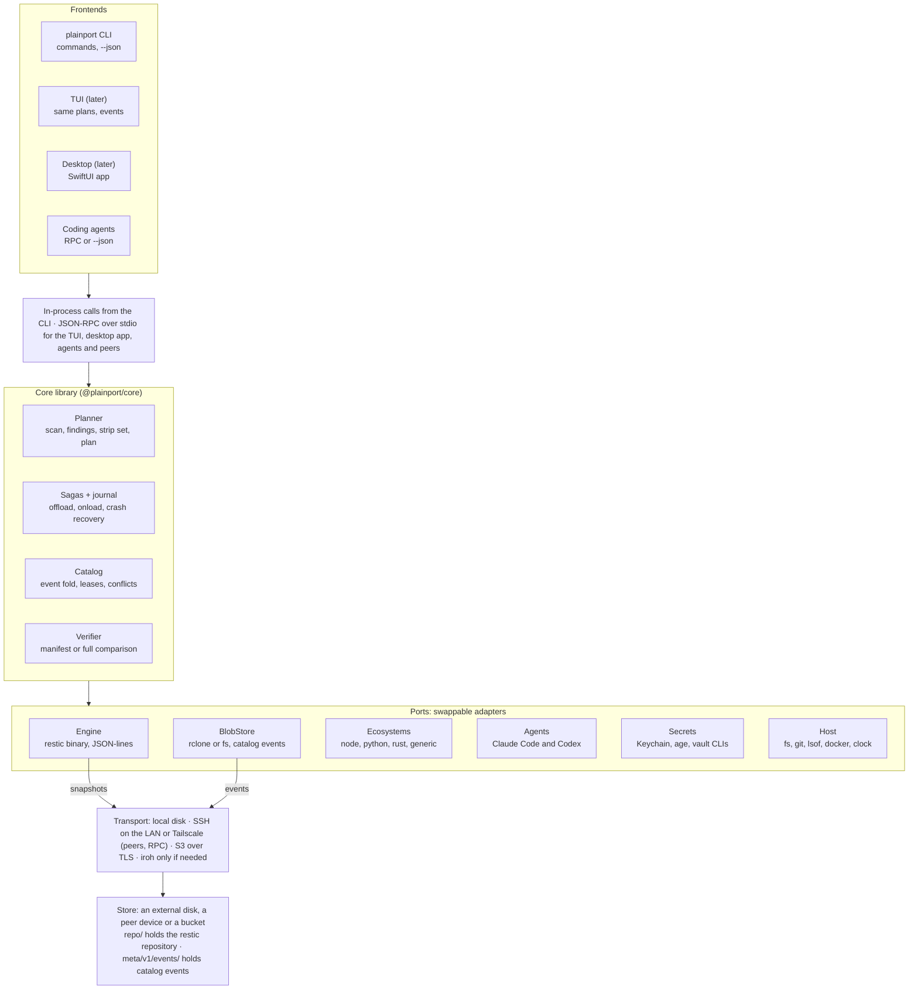
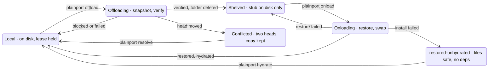
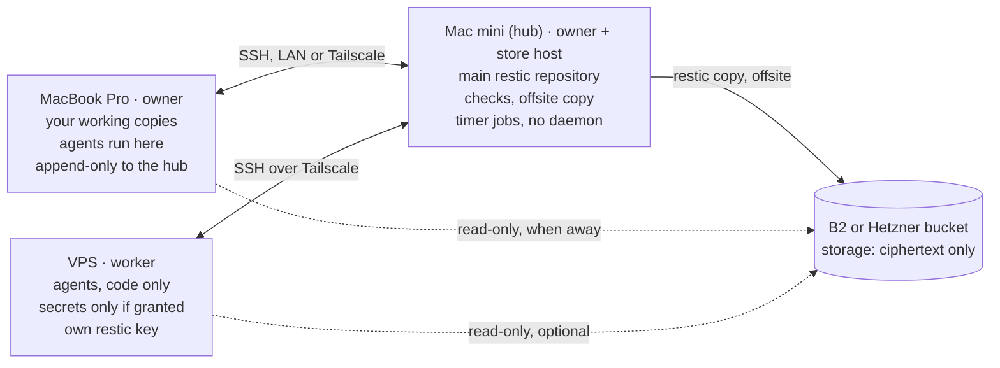

# plainport — offload, onload and move coding projects: design

2 October 2026 · Tamas

> Exported from the living design doc on 2 October 2026. From here on, this file is the source of truth;
> the claude.ai doc is the archive. Diagrams are rendered as Mermaid.

## Summary

plainport keeps your coding projects portable across your machines and storage. `plainport offload myapp` snapshots a project, verifies the snapshot and deletes the local copy, and `plainport onload myapp` restores it and reinstalls dependencies from the lockfile. `plainport move myapp --to mini` hands it to another machine together with what your coding agents remember about it, and `plainport kit apply` gives every machine's agents the same skills and MCP servers.

The core is a TypeScript library; the CLI, a later TUI and a desktop app are thin clients over the same API, and agents drive it through `--json`. Snapshots are plain restic repositories, so your data stays readable with stock restic even if plainport is abandoned. plainport is a standalone sibling of plainkeep and follows its contract (see Prior art).

**Goals**

- **Free the disk.** An offloaded project leaves only a small `myapp.plainport` stub file behind.
- **Never lose work.** The local copy is deleted only after the snapshot matches a scan of the folder. Uncommitted changes, stashes, unpushed branches and `.env` files all travel with it.
- **Fast return.** Onload restores files, then rebuilds `node_modules` (or `.venv`, `target/`) with the project's own package manager.
- **Move between machines.** `plainport move myapp --to mini` hands a project to another device over SSH, with exactly one working copy at a time. Agent sessions resume there, the agents get the same skills and MCP servers, and a trip back transfers only what changed.
- **Your folder layout on every machine.** Named roots such as `work` and `personal` map to different paths on each device, chosen at setup and changeable from the CLI, the config file or the app.
- **Agent-safe.** Every command runs non-interactively, prints `--json` and uses stable exit codes. It refuses to act while a process holds files open in the project, and nothing deletes history without your confirmation.
- **Storage-agnostic and self-hostable.** A home Mac mini or NAS, an S3-compatible bucket or an external SSD, all EU-hostable.
- **Maintenance-free.** File-based catalog, open formats, no database and no required daemon.

**Non-goals for v1**

- Live sync between machines. That is Syncthing or Mutagen territory; a project has one working copy at a time.
- Replacing git remotes or Time Machine. plainport warns about unpushed work but never pushes for you.
- Capturing runtime state such as Docker volumes or local databases. Hooks cover these instead.
- Converting sessions between agents. Codex's `/import` and `grok import` already do that.
- Steering agents remotely or streaming terminals. Claude Code's Remote Control and OpenHarness do that; plainport moves the folder they work in.
- Windows. macOS first, Linux second.

## Core concepts

These nouns carry the whole design. Everything else in this doc is built from them.

| Term | Meaning |
| --- | --- |
| Project | A folder inside a root, addressed as root plus relative path (`work:clients/acme/web`). Identified by a stable ULID, so renames and moves don't break it. |
| Root | A named folder of projects, such as `work` or `personal`. Each device binds it to its own path, so a project lands in the right place on every machine. |
| Device | A machine running plainport, with its own identity and a role: owner, worker or storage. Your MacBook, a home Mac mini, a VPS. The hub is the owner that hosts the main store; here, the Mac mini. |
| Store | A place snapshots live: an external disk, a repository on another device (a peer store) or a bucket. One store = one restic repository plus a small catalog folder beside it. Stores can replicate to each other. |
| Transport | How bytes reach another device or store: local disk, SSH on the LAN or over Tailscale, S3 over TLS. |
| Snapshot | An immutable, verified copy of one project at one offload. Addressed by plainport's own ULID, because restic gives a copied snapshot a new ID in every repository. |
| Catalog | The record of every project, root, device and state. Small JSON event files on each store are the source of truth; each machine keeps a cache. |
| Lease | A record saying "project X is onloaded on device D since T". It prevents two working copies from drifting apart. |
| Stub | The `myapp.plainport` file left where the folder was. It holds the project ID, root and store, so Finder, you and agents can see what is shelved. |
| Strip set / keep set | What is left out because it can be regenerated (`node_modules`, `.next`, `dist`) versus what is always kept even if gitignored (`.env*`, local config). |
| Parked copy | A moved project's source folder, kept for a few days so a trip back transfers only what changed. A cache, never a second working copy. |
| Agent state | A coding agent's sessions, memory and settings for one project, stored outside the project and keyed by its path. Adapters carry it with the project. |
| Kit | The skills, MCP servers and instructions your agents should have on every device, declared once in your dotfiles. |

Seven principles shape every section; the last five come from plainkeep (see Prior art):

- **Gitignored does not mean disposable.** `.env`, local SQLite files and editor settings are usually gitignored and still precious. plainport strips only what a plugin or you declare regenerable; every other file goes into the snapshot.
- **Plan, then execute.** Every operation first builds a plan: which files go, what gets stripped, sizes, warnings and blockers. `--dry-run` prints the plan and stops. The CLI, TUI and desktop app all render the same plan object.
- **One contract for people and agents.** Every command declares a risk class (`read`, `safe_write` or `confirm`) in a generated `plainport.json`. Anything that sends data off the machine or deletes it needs `--yes`, and the final `--json` line uses plainkeep's envelope shape, with exit codes 0 to 5 meaning what they mean there.
- **No resident daemon.** Scheduled work runs as timers that each run one command and exit; offsite replication runs restic directly with an append-only key.
- **Deletion needs a human.** Nothing deletes history on a timer. `prune --yes` fetches the delete-capable key from your password manager for that one run.
- **Git can stay the truth for code.** A root can set `requirePushed = true`, so a snapshot only holds what git can't: uncommitted work and ignored files.
- **Touch only what you installed.** Skills, MCP servers and agent state change through the agents' own commands, and plainport alters only items its ledger says it put there.

## Architecture

plainport is a TypeScript core with swappable ports underneath and thin frontends on top. The core owns every decision and every state change; ports only move bytes or answer questions about the machine.



*Every frontend drives one core; storage is reached only through ports.*

Only the engine, the blob store and peer RPC touch the network, and always through the transport layer. Replacing restic, rclone or the Keychain means writing one adapter, with no change to the core or any frontend.

## Project lifecycle

A project is always in exactly one state, and only a verified, committed snapshot moves it to Shelved. The two transient states are journaled, so any interruption resolves to a stable state on the next command.



*Only a verified, committed snapshot moves a project to Shelved. Offloading and Onloading are in progress and journaled; Conflicted and restored-unhydrated need your action.*

A seventh state, `unavailable`, overlays the others: a project whose root volume is unmounted keeps its last state and reappears unchanged when the volume returns. A parked copy left behind by a move is a cache on the source device, not a project state.

**What `ls` and `status` show.** Each project this device knows, from its registry and from the catalog of every store it set up, is in exactly one of these states as this device sees it: `unavailable` (its root's volume is not mounted), `offloading` or `onloading` (a journal of it is open, running or interrupted), `conflicted`, `restored-unhydrated`, `local` or `shelved`. Beside the state, `conditions` (an open set, so a reader passes unknown ones through) name what needs attention: `incomplete` (the catalog names snapshots it does not hold, so there is no head, D41), `diverged-after-commit` (committed and shelved in the catalog, but the folder stayed here with later edits and no stub, D51), `head-moved`, `interrupted` or `running` (running only while the journal's process holds the project's lock, taken since this host booted, so a pid another process reuses after a crash or reboot never looks running), `folder-missing`, `journal-unreadable` (a journal this version cannot read names the project, or names none and so may be any project's; `ls` lists every such journal), and `stale` or `never-synced` when the store did not answer and the catalog came from this device's mirror (D45), `catalog-unreadable` when neither could be read. A mirror that cannot be opened is only a cache: the store is read directly. For a project whose folder is here, `status` also runs the offload's read-only planning (as `--dry-run` does, saving no plan) for its git warnings and the bytes an offload would strip now. Both commands only read. The view model lives in core, so the CLI and a later TUI only render it: each project's view carries its conditions with one sentence each (`conditionDetails`), the next step (`next`: a command and why), every open journal (`journals`, oldest first), the released trash awaiting deletion (`trash`: its deadline, or `deleting` while a live detached delete claims it, D64) and, for `status`, the local details. Views are lazy: the registry, roots, journals and catalogs are read once, since a name is matched against every project, but a project's own view is built only when a command needs it (`status` and `restore` build one or none), and a never-offloaded folder's size is computed only for `ls`, which shows it, never walking `.git` or a dependency folder an ecosystem plugin names (`dependencyFolders`, such as `node_modules`). A project matched by name keeps its stub, so `restore` reads the store the stub names.

**Recover.** `plainport recover` settles every open journal on this device, one project at a time under its lock (and the locks nested with it, D53), by the saga's recover table: before the commit it rolls back (the journal and any staging folder go, nothing else), after it it finishes with the live saga's own functions (`releaseOffload`, `finishOnload`), and where a lost write could leave the journal behind its effects it asks the store first (D24, D50). An event counts only when its file parses, validates and is the journal's own (its op, snapshot and stored id): a torn write on a store without hard links (D41, D42) or another operation's event is never a commit, so the folder stays and the report names the file. The store is the journal's by its own `meta/v1/store.json` (D45). A project whose root folder is not there (an unmounted volume) is `unavailable`: its journal stays and nothing is touched. A step this version does not know stays pending (`journal.pending`). A journal this version cannot read is never touched and is named on stderr at the start of every command; while its `project.id` still reads it holds back only that project (and those nested with it), and when it names none it holds back every project. Every event recovery relies on (the offloaded commit, a snapshot-discarded or fork record, the onloaded event `finishOnload` appends) must be whole and the operation's own; a torn or foreign file under its id is written again under a new id, journaled first, and never taken for the record. Within a project, an operation that stays pending holds the later ones, which wait as pending, since their order matters (an onload renaming a trash back before that trash's deletion). Each operation ends `rolled-back`, `finished`, `forked`, `diverged-after-commit`, `trash-deleted`, `trash-kept` or `pending` (not settled now: a store that does not answer, a lock a live process holds, a folder in the way), with the project's state afterwards. A `pending` operation keeps its journal and recover can run again at any time; the command exits with the most severe code across every project (D64: 8 for `diverged-after-commit`, then 7, 6, 11, 9, 5, 10, 4, 3, 2, 1; 130 when Ctrl-C stopped it) and its report as the error's data. Recover routes each step by an exported step→rule table per saga (`OFFLOAD_RECOVERY`, `ONLOAD_RECOVERY`, with each rule's possible outcomes in `RECOVERY_RULE_OUTCOMES`); a step missing from it is pending. The first Ctrl-C stops recover before its next operation (each one before it is settled or still journaled): the rest are reported pending with `operation.cancelled`, exit 130. A folder that stands at the project's place after release moved the project aside is never released or stubbed over (`path.occupied`).

## Offload process

Offload is an eight-phase saga, and the local folder is touched only in the last phase, after the snapshot is verified. Each phase boundary is written to a journal on disk, so a crash, a closed lid or a dropped network resumes or rolls back cleanly with `plainport recover`.

1. **Resolve and lock.** Resolve the argument (address, path, `.` or a stub file) to exactly one project. Take a per-project local lock; a lock held by a dead process is broken automatically. The locks of the registered projects nested with it are taken too, nesting decided by each project's effective folder (its `--to` override, else its root's place) rather than its address, compared as canonical real paths (symlinks resolved, case folded on a volume that ignores it), and a folder that holds a registered project whose effective folder is here is blocked (`project.nested`: offload the inner project first) (D53).
2. **Preflight.** Every check produces a finding with a stable code, and blockers stop the run here:
   - the store is reachable and the credentials work
   - no process holds files open or has its working directory inside the folder (dev servers, editors, agents)
   - no git operation is running (`.git/index.lock`), and no container bind-mounts the folder
   - no file is an iCloud or Dropbox placeholder (dataless) that would fail to read
   - the folder is not a linked git worktree, and no linked worktrees of it live elsewhere
3. **Scan.** Walk the tree once. Record path, type, size, mode, mtime and symlink target, plus git facts: dirty and untracked files, unpushed commits, stashes, local-only branches. Hash the result into a fingerprint. What plans and journals record is the included fingerprint (version 2, stored beside it as `fp`): the strip set is left out, since those paths are not in the snapshot and are regenerable, so a watcher writing only to a stripped cache fails nothing, while any change to an included path still does; a fingerprint of another kind is never compared (D53).
4. **Strip set.** Ecosystem plugins propose regenerable paths. A path is stripped only if a plugin claims it *and* git does not track it, so a tracked `build/` folder or a committed `.yarn/cache` is always kept.
5. **Plan.** Assemble included files and bytes, stripped paths with reasons, the ten largest paths, the included files a `.gitignore` in the project ignores (they travel: gitignored does not mean disposable), warnings, blockers and an upload estimate. `--dry-run` stops here. The interactive CLI shows the plan and asks once; `--yes` or an approved `--plan <id>` skips the question.
6. **Snapshot.** Re-check the fingerprint (cheap: mtime and size), then run `restic backup` with the strip set as excludes, the previous snapshot as `--parent`, and plainport tags. Restic exit code 3 (some files unreadable) is a hard failure, never a partial success. Agent adapters capture each agent's state for the project beside the snapshot, sealed in the secrets envelope; the agents' own copies stay where they are.
7. **Verify and commit.** Compare `restic ls --json` for the new snapshot with the manifest: same entries, sizes, modes and link targets. Re-stat local files to catch edits made during the upload. Then check the head: the store's latest snapshot of this project must be the one this working copy came from. If so, append an `offloaded` event to the catalog, which also closes the lease.
8. **Release.** Rename the folder into `<root>/.plainport-trash/` (instant on the same volume), write `myapp.plainport` where it stood, then delete the trash from a detached process, so the command returns at once. Until it is deleted, onloading the same head just renames the folder back. A configurable grace period (`keepLocalFor`, default `0`) can hold the trash for a day before deleting.

**Journal steps.** The journal records `offload.begin`, then the preparation as it goes (`preflight.done`, `scan.done`, `strip.done`, `planned`, which also records the release policy: `keepLocalFor` and `stub`), `snapshot.start`, `snapshot.discarded` (restic exit 3 only), `snapshot.done`, `verified`, then either `diverged` (the head moved: the event keeps the snapshot as a fork and nothing is released) or `commit.start` (the offloaded event's id, before it is appended), `committed`, `release.trash` (the trash path, before the rename), `release.moved`, `release.stub` and `release.delete`; the saga exports this list, and the crash matrix stops at each step. Every side effect (an event appended, the rename, the stub, the registry update, the detached delete) is also followed by a crash seam that writes no journal (`OFFLOAD_AFTER_EFFECT`), so the matrix reaches the states a lost journal write leaves, and `OFFLOAD_BRANCHES` names what makes a run take each branch (D52). An edit during the upload makes the offload plan again from preflight (a new strip set, new findings) and snapshot once more; with an approved plan it refuses instead (`plan.stale`, the fresh plan as data). Before `snapshot.done` recovery rolls back, writing a journaled `snapshot-discarded` event first if the store lacks it. After `snapshot.done` or `verified` it first searches the store for an event of this operation, since a power loss can drop the `commit.start` or `diverged` write after the event landed (D24, D50): none, and it rolls back; one the fold's `conflicts` name, and it keeps the folder as `diverged` does (a fork); while the catalog has no head for another reason (a base it does not hold, D41), the operation stays pending with `catalog.incomplete` and its journal, since neither a commit nor a fork can be told yet; otherwise (the head is the snapshot, or one made from it since) it finishes release (D61). At `commit.start`, recovery looks for the event on the store and finishes release only if it is there and the operation's own. From `committed` on it goes by the journal alone and does not open the store: the `committed` write follows an append that returned only once the event was validated and durable on the store (D24), so a journal can say `committed` only for an event the store holds. Either way it finishes release only while the folder, if it still stands, has the verified fingerprint the journal holds; a folder changed since (the machine may have been used for hours before `recover` runs) is kept, no stub is written, and recovery reports `offload.diverged-after-commit` naming the snapshot, which is the head; the device's base becomes it, so the next offload builds on it with the edits and no `resolve` is needed (D51, D52); when the `release.trash` write was lost, it derives the trash path from the journal's project folder and operation. Release is resumable stage by stage (rename, stub, registry, delete), each checking whether it is done, so recover calls the same function from any step from `commit.start` on. When a crash lost the `diverged` step's fork event and recovery writes it, the journal does not hold the snapshot's totals: the event's `files` and `bytes` are counted again from the snapshot's listing, `strippedBytes` is 0 and `ecosystems` is empty, and `rootMode` is read from the folder; `ls` and `status` show those as the fork's size. A run that fails or is cancelled before the commit has changed nothing local and closes its own journal; an expected I/O failure after it returns `fs.write-failed` and leaves the journal to recover. Right before the rename, release compares the folder's fingerprint with the verified one, in the live run as in recover: a folder edited after verification is kept, gets no stub, takes the committed snapshot as its base, and the run ends with `offload.diverged-after-commit` (exit 8, D52). Ctrl-C is honoured at the safe points up to the commit; a Ctrl-C that lands after the commit stops before release (exit 130, the journal kept for recover), and plainport waits for a running saga's own report however long it takes, so 130 comes only from the saga (D52). Release renames the folder to `<root>/.plainport-trash/<op>/<name>`; the detached delete (the one exception to the process runner, D47) first claims the trash with `<root>/.plainport-trash/<op>.claim` (this device's id, its pid, this host's boot time and start time), then removes that folder, the claim, then the journal (D67), then `<root>/.plainport-trash` itself if that left it empty (rmdir, so it stays while another operation's trash is in it; `gc`, `recover` and an onload that renames a trash back do the same, and release makes it again), so a crash never leaves a claim no journal leads to; a `release.delete` journal whose trash folder is already gone (its root here, no live claim) is finished: housekeeping in a write command and `gc` close it silently, and nothing reports it as "nothing is deleting it"; plainport goes on only once the claim is written, and a delete that cannot write it within a few seconds is stopped before it deletes anything. A trash has one deleter at a time (D64): housekeeping, `gc` and `recover` leave a trash alone only while its claim is live (this device's, from this boot, its pid alive: `trash-kept`, or kept by `gc` with a reason naming the claim file) and take over anything else, claim and any stray `.claim.tmp` included; a due trash nothing deletes is named on stderr at the start of every command, and in the view's `next`, with `plainport gc`; `gc` and `recover` settle due trash themselves under the lock, so their own start-of-command housekeeping hands none to a detached delete. With `keepLocalFor`, the journal stays at `release.delete` until the trash is due, and `gc` or `recover` deletes it then. The stub is created exclusively, or replaces this project's own stub after moving it aside and comparing it; anything else at the path, of any kind and whenever it appears, is never overwritten (`path.stub-occupied`, D47, D48). Verification re-stats the folder before and after reading the snapshot's listing, so an edit made while the listing is read is caught. An approved plan runs only as approved: the same folder fingerprint, options, strip set, findings and store identity (D48); otherwise `plan.stale` carries the fresh plan, and its fix is the exact command that runs it. A store serves one root (ADR-0010, D48, D50): before its first `root-created` event, an offload claims the store for its root with an exclusive create of `meta/v1/root.json`, so of two roots' first offloads at once exactly one goes on; a claim that is empty or partial (a store without hard links, written in place) is read again a few times and then refused (`store.failed`), never written over (D51); an offload of another root, or to a store whose catalog already holds another root, is refused (`store.root-mismatch`) before it writes anything. `offload.verify = "full"` is refused (`usage.invalid`) until M5 builds it.

**Verification levels.** `manifest` (default) catches missing, unreadable and changed files. `full` also streams the snapshot back as a tar (`restic dump`) and hashes every file against the local copy; it doubles transfer time and suits LAN stores.

**Conflict at step 7.** If another machine offloaded the same project since this copy was onloaded, the new snapshot is kept but tagged divergent. Nothing local is deleted, the exit code is 8, and `plainport resolve myapp` lets you keep either or both. To compare them, it writes the other copy into your repository as a commit on `refs/plainport/theirs/<snapshot>`, built through a temporary index so your own index and branch stay untouched. `git diff HEAD refs/plainport/theirs/…` and `git checkout -p` then work as usual.

## Onload process

Onload restores into a hidden staging folder, verifies it, then swaps it into place with one rename. Dependency hydration runs afterwards, and a failed install never undoes a good restore.

1. **Resolve and lock.** Accept a name, a stub file or `--snapshot <id>` for an older version. Take the per-project lock.
2. **Preflight.**
   - the store is reachable and the target volume is mounted and writable
   - the target path is free; otherwise onload stops and suggests `--to <path>` (it never merges into an existing folder)
   - free space covers the snapshot, the dependency size recorded at offload, and a 10% margin
   - case safety: if the snapshot holds names that differ only by case (`Foo.ts`, `foo.ts`) and the target volume is case-insensitive, block
   - lease: if another device holds the project, warn; with `leases = "strict"`, block
3. **Restore.** `restic restore` the project subtree into `<root>/.plainport-staging/<opId>/`. After an interruption, the rerun reuses the same staging folder, and restic's `--overwrite` modes skip files already written.
4. **Verify.** Compare the staged tree with the snapshot listing: entry count, sizes, modes, link targets. Content is already authenticated by restic's encryption as it decrypts each blob.
5. **Swap.** Rename staging to the target path, remove the stub, and append an `onloaded` event with host, path, base snapshot and the head it was written over. That event opens the lease.
6. **Agent state.** Each adapter places its captured state for the landing path, skipping anything the agent already holds, and checks the result with the agent's own read-only listing (see Agent state).
7. **Toolchain.** The plugin reads `packageManager`, `engines`, `.nvmrc`, `.node-version`, `.tool-versions` or `mise.toml`. If mise, fnm or Volta is installed it activates the right version; otherwise it warns when the active version doesn't fit.
8. **Hydrate.** Run the plugin's frozen install in the project, such as `pnpm install --frozen-lockfile` or `npm ci`. On failure the project is marked `restored-unhydrated` with exit code 10: files are safe and `plainport hydrate myapp` retries.
9. **Post hooks.** Run trusted hooks only, for example `docker compose up -d db` or `prisma generate`.

**Journal steps.** The journal records `onload.begin` (the snapshot, the head it is written over, the landing folder, the staging folder or, for a renamed-back trash, `reuse`), `onload.restore.start`, `onload.restored`, `onload.verified`, `onload.swap.start`, `onload.swapped`, `onload.commit.start` (the onloaded event's id, before it is appended) and `onload.committed`; the saga exports this list (`ONLOAD_STEPS`), the after-effect seams (`ONLOAD_AFTER_EFFECT`: the rename, the cleared trash, the removed stub, the appended event, the registry update) and `ONLOAD_BRANCHES`, so the crash matrix stops at each. The swap's rename is the commit: before it nothing outside the staging folder has changed, so a failure or a Ctrl-C removes the staging folder and the journal and the stub stays; after it every step goes forward, and recover finishes it. An onload stopped before its swap is taken over by the next onload of the same snapshot to the same folder, which restores into the same staging folder with `--overwrite if-changed`; one of another snapshot or folder is rolled back first. The staging folder sits in `<root>/.plainport-staging/` (with `--to`, beside the landing folder, whose parent must exist), on the landing folder's volume, and its holder is left in place for other onloads. Preflight reads the snapshot's listing once, for case collisions (probed on the landing volume itself) and for the space it needs (the listing's bytes plus the offloaded event's `strippedBytes`, plus 10%). The stub is removed only while it reads as this project's (D47). The project folder's own mode, which a snapshot does not hold (restic stores the folder's contents), travels as the offloaded event's `rootMode` and is set right after the swap; an event without it leaves a new folder's mode (D55). Until an offload's trash is deleted, onloading the same head renames that folder back instead of restoring it, but only when `keepLocalFor` holds the trash (no detached delete can be running in it) and the folder still has the fingerprint its offload verified (D51); the offload's journal and empty trash folder are removed afterwards, and its dependencies come back with it (the output says so: `restored: "reuse"`, `reused` names the folder and why, and the hydrate report gives the reason nothing was installed). Onload takes the locks of the registered projects nested with its landing folder, as offload does, and refuses a `--to` inside, or at, another registered project's effective folder (`project.nested`), whose offload would take the copy along (D53). If the store cannot be read at the head re-check before the swap, the journal and staging stay and the next onload takes them over. The landing place is never merged into: anything there is `path.occupied`, including the folder `offload.diverged-after-commit` kept, which onload names as the project's own working copy. `--to` lands wherever its path is free, except while this project's own onloaded copy is on the device: a device holds one working copy, so that refuses with `project.already-local`, whose fix is `plainport restore --snapshot <id> --to <path>` for a side-by-side copy (D56). Registry.json records the copy's base (`over`), its onload time, `override` whenever it lands off the root's place for it (so a later plain onload lands there again), and `unhydrated` until the install succeeds (restored-unhydrated, also after `--no-hydrate`). Right before the swap the head is read again: when it moved, an onload of the head refuses (`catalog.head-moved`) and one of an older snapshot named with `--snapshot` is written over the new head; a resumed onload is likewise written over the head as it is then (D43). After the swap, `finishOnload` does the rest from the journal alone (the folder's mode, the cleared trash, the stub, the event, the registry), each stage checking whether it is done, so recover finishes an onload with the same function.

**Hydration.** The toolchain step activates a node version pinned by `.nvmrc`, `.node-version`, `.tool-versions` or `mise.toml` through the first of mise, fnm and Volta on PATH (`mise exec node@<v> --`, `fnm exec --using=<v> --`, `volta run --node <v>` around each install); without one, and for `engines` and `packageManager`, it compares the active versions and warns `toolchain.mismatch`. Each install runs through the process runner in its install root with the user's environment minus plainport's own `PLAINPORT_*` variables, a ten-minute idle deadline and a one-hour overall one, then `git update-index -q --refresh` runs once. Ctrl-C during the install, after a good restore, exits 130 (`operation.cancelled`, fix `plainport hydrate`) and leaves the project restored-unhydrated (D56). In M1 the plugin's frozen install runs with package scripts enabled, while a project's `.plainport.toml` `hydrate.command` and hooks never run (no `plainport trust` yet) and the result lists them as skipped (D54). `plainport dehydrate` removes only the installed dependencies a plugin claims and git does not track (`strip.keep` and `strip.never` apply), never inside a registered inner project, refusing while a process works in the folder; `hydrate` and `dehydrate` take the nested projects' locks as onload does (D53, D56).

`plainport onload` is also how a second machine picks up a project offloaded elsewhere, and `plainport move` runs offload and onload on two machines as one operation (see Machines). On a different machine the preflight adds git checks: identity, signing, remote credentials, LFS and case rules. `plainport restore myapp --snapshot <id> --to ~/tmp/old` pulls an older version side by side, with no lease and no hydration (D58): it runs onload's snapshot check and restore-and-verify into a staging folder beside the landing path and renames it into place, only where nothing stands and never inside a registered project's folder (`project.nested`); it appends no event, writes no registry entry and leaves the stub and the working copy alone, so it stays allowed while the head is conflicted or incomplete (D44), and those refusals of onload name it. Without `--snapshot` it restores the head; when there is none (incomplete or conflicted) `--snapshot` is required, and the refusal (`usage.invalid`) lists the candidate ids (D60). It takes the project's lock and those of the projects nested with the landing path (D53), so it refuses while another operation runs or an interrupted one is open (`journal.pending`). It is not journaled: it records its staging folder under plainport's state first, any failure removes that folder (and the shared `.plainport-staging` holder only when it is empty), and a crash leaves at most `<parent>/.plainport-staging/<op>/`, which `gc` removes once no live operation owns it (D60). The landing folder is made exclusively and the restored copy renamed over that empty folder, so nothing another process puts at the path is ever replaced; and since a restore installs nothing, its space check leaves out the stripped dependencies. `status` and `restore` resolve a project the same way: a plain name is a suffix across every project this device knows, registered or catalog-only (two matches are ambiguous, exit 2), and a path whose folder is gone matches the project's folder or stub.

## Storage: engine and metadata

Use restic as the snapshot engine for project data, and keep plainport's own catalog as small files beside each repository. Never upload project files one by one through a generic file SDK.

A generic SDK would copy 30,000 to 300,000 small files one by one, with no deduplication, no encryption and no atomic snapshot. Rebuilding that on top of an SDK means rewriting restic, badly. Restic already gives:

- content-defined deduplication, so a repeat offload uploads only what changed
- authenticated encryption and `restic check` for integrity
- JSON-lines progress, summaries and file listings, plus stable exit codes ([restic scripting docs](https://restic.readthedocs.io/en/stable/075_scripting.html))
- backends for local disk, SFTP, REST server, S3-compatible, B2, Azure, GCS and Swift, plus rclone for many more
- repositories that stay readable with stock `restic`, with or without plainport

**The metadata layer needs much less.** plainport keeps a few kilobytes of catalog events next to the repository, readable from every machine. Events are immutable files with unique ULID names, and conflicts surface when the events are folded, so the layer needs only put, get and prefix listing. Conditional writes are a bonus, not a requirement.

| Option | What it is | Conditional writes | Fit for metadata |
| --- | --- | --- | --- |
| rclone CLI | Go binary with backends from S3 and SFTP to Google Drive, already used for the append-only data plane | No | **Pick.** No native module, so plainport can ship as one compiled binary, and it runs through the same process runner as restic |
| [OpenDAL](https://www.npmjs.com/package/opendal) (`opendal` on npm) | Rust core with a native Node binding over S3, GCS, Azure, local fs and 50+ services | Yes: `ifNotExists`, `ifMatch`, gated by capability ([WriteOptions](https://opendal.apache.org/docs/rust/opendal/options/struct.WriteOptions.html)) | Strong, but a native module complicates a single-binary build. The fallback if conditional writes are ever needed |
| [Flystorage](https://github.com/deltic-oss/flystorage) | TypeScript file-storage abstraction by the Flysystem author | None listed | Good API, but no compare-and-swap |
| [unstorage](https://unstorage.unjs.io/drivers/s3) | unjs key-value layer with many drivers | None | Key-value, not files |

The choice is low-risk because every adapter sits behind the six-method `BlobStore` interface (section below): `node:fs` for local disks and mounts, the peer's own RPC for devices running plainport, and rclone for buckets and SFTP. Swapping in OpenDAL later means writing one adapter.

**Store kinds.** One store definition in config produces both the restic repository URL and the metadata location, so both layers always point at the same place.

| Store | Restic repository | Metadata | Notes |
| --- | --- | --- | --- |
| Peer device (Mac mini, VPS) | `rclone:` backend running `rclone serve restic --stdio --append-only` over SSH | Peer RPC over the same SSH link | The recommended hub. Other devices can only append; pruning runs there when you ask |
| External SSD or local disk | `/Volumes/Archive/plainport/repo` | `node:fs` with exclusive create (a hard link where the volume has them, an `O_EXCL` open on exFAT and FAT) | Fastest; not off-site |
| NAS over SFTP | `sftp:nas:/volume1/plainport/repo` | rclone over SFTP | For a NAS that can't run plainport; full access, so no append-only |
| S3-compatible bucket (Backblaze B2, Hetzner, Scaleway, MinIO) | `s3:https://<endpoint>/<bucket>/repo` | rclone over S3, same bucket | Best as the hub's offsite replica. Pick an EU region; keep only the latest object version |
| Restic REST server | `rest:https://nas:8000/plainport` | Not supported | Use a peer store instead; the REST protocol can't hold metadata files |

**Layout on every store:**

```
<store root>/
  repo/                      restic repository (config, data/, index/, keys/, snapshots/)
  meta/v1/
    store.json               the store's identity {v, id}, written once at setup
    root.json                the root the store serves {v, root}, claimed create-only by its first offload
    events/<ulid>.json       append-only catalog events, never overwritten
    state.json               compacted fold of events (optional, rebuildable; M1 keeps it beside the mirror instead)
```

The `Engine` interface keeps other engines possible later: rustic or Kopia, or a single-file `tar + zstd + age` engine for exports you can open with standard tools.

## Machines: moving projects between devices

A second machine is just another device with a role, reached over SSH. Moving a project there is an offload into a store the target can reach, followed by an onload that runs on the target. The project passes through the safe `shelved` state in between, so no distributed transaction is needed.

**Device roles**

| Role | Holds | Example | Can |
| --- | --- | --- | --- |
| Owner | Its own restic key, a secrets identity, recovery rights | MacBook Pro, Mac mini | Offload, onload, move, pair devices, request deletion |
| Worker | Its own restic key; secrets only when granted per project | A VPS where agents run | Onload, work on code, offload back |
| Storage | No keys at all; sees only ciphertext | Offsite bucket, NAS | Host a store |

A restic key opens the whole repository, so a worker that should see only some projects needs a store of its own.



*The Mac mini is the hub: other devices only append, and deleting needs you. Solid: read and append over SSH. Dashed: read-only. Nothing deletes without your `prune --yes`. Each SSH session also carries plainport's JSON-RPC, so any device can drive a move.*

The bucket holds only ciphertext. The Mac mini writes to it with an append-only key; the key that can delete lives only in your password manager.

**Recommended topology: the Mac mini is the hub.**

- The MacBook reaches the Mac mini over SSH with an append-only key. It can add snapshots and read them, but never delete or rewrite them.
- The Mac mini keeps the main repository on its own disk and runs checks and replication locally, and pruning when you ask, where they are fast and need no network.
- Offsite, the Mac mini copies snapshots to a bucket with `restic copy`. Both repositories are initialised with the same chunker parameters so copies stay deduplicated, and the mini writes with an append-only key while the delete-capable one stays in your password manager ([restic docs](https://restic.readthedocs.io/en/stable/045_working_with_repos.html)).
- A VPS worker reaches the Mac mini over Tailscale, or reads the bucket replica with a read-only key.
- Away from home, onload reads from whichever replica holding the snapshot answers fastest.

**Moving a project** (`plainport move web --to mini`)

1. **Plan both sides.** The source builds its offload plan. The target's preflight runs over RPC: free space, toolchain, case sensitivity, git identity, secrets policy, and the root's binding and allowed devices on the target. The combined plan lists what each part becomes on arrival: files, dependencies, agent sessions, secrets, git access, and programs that were running.
2. **Pick the store.** Use the root's store if it names one; otherwise prefer a store on the target, then the one the target reaches fastest. The handoff snapshot goes there.
3. **Offload on the source,** phases 1 to 7 as usual, plus agent sessions and an optional handoff note (`--handoff`). The `offloaded` event records the move and its target.
4. **Park the source copy.** The folder is renamed into `.plainport-parked/` and the stub is written. It stays for `move.keepSource` (default seven days) or until disk space runs low, so a trip back is cheap.
5. **Onload on the target** as a detached job in the target's own journal: restore, verify, swap, agent sessions, toolchain, hydrate. Events stream back over the RPC channel, and `plainport attach <op>` reconnects if the laptop slept.
6. **Finish.** On success, the target's `onloaded` event takes the lease. On failure the project stays shelved, and `plainport onload web` on the source renames the parked folder back instantly because the head has not moved.

**Where the saga runs.** The source device drives the whole move as one detached, journaled job; the device you typed the command on only watches. Started on the MacBook for a mini-to-VPS move, it hands the saga to the mini over SSH and can then sleep, and `plainport attach` picks the progress back up. Only an upload from the MacBook itself needs it awake, because the data lives there; after a cut, the rerun skips data the store already holds.

`plainport move --copy` forks instead: a new project ID that records `forkedFrom`, with its own lease and history. Two live copies of one project are never allowed; parallel work belongs in git branches.

**Warm return.** When a project comes back to a device that still holds its parked copy, plainport clones that copy into staging with copy-on-write (`cp -c` on APFS, reflinks on Linux where the file system has them). It then restores in place into the clone with restic's `--overwrite if-changed --delete`, which rewrites only mismatching files and removes files the snapshot lacks ([restic restore docs](https://restic.readthedocs.io/en/stable/050_restore.html)). The strip set is passed as the exclude list that `--delete` requires, so `node_modules` survives and hydration usually has little to do. If the parked copy changed after parking, a backup checkpoint comes first.

**Adopting an existing clone.** If the landing path already holds a clone of the same repository (same normalized origin URL and root commit) with no uncommitted or unpushed work, plainport adopts it as the warm seed instead of stopping: backup checkpoint, clone into staging, in-place restore, swap. A diverged or dirty clone still stops the move with `path.occupied`; `--adopt` accepts it after the backup.

**Git access on the target.** A target that can't reach the git remote gets warning `git.remote-auth`. plainport never lends your tokens: each device brings its own credentials, which on a worker means a deploy key or a bot account.

**Transport: SSH first, nothing new to operate.**

- **Reach.** The LAN at home, Tailscale when away (no open port on the Mac mini), a public IP for a VPS. SSH authenticates by key and encrypts in transit, and restic's encryption sits underneath, so data is encrypted twice.
- **SSH policy.** `BatchMode=yes` and strict host keys, so nothing ever prompts. Your `~/.ssh/config` applies, including a `ControlMaster` you opened for an MFA host, but plainport never creates or keeps a master itself. A failed host is retried with backoff capped at 30 seconds.
- **Data plane.** Restic's rclone backend runs `rclone serve restic --stdio --append-only <repo>` on the peer through an SSH forced command. That key can reach one repository and only append to it, the pattern [rsync.net documents](https://www.rsync.net/resources/notes/2025-q4-rsync.net_technotes.html).
- **Control plane.** `ssh <peer> plainport serve --stdio` carries the same JSON-RPC the desktop app uses.
- **Later: iroh.** Dialing a device by its public key, with hole punching and relays that can only forward encrypted traffic ([iroh docs](https://docs.rs/iroh)), would replace Tailscale, which already gives direct WireGuard connections with relay fallback. It needs a daemon reachable on every device, so it gets built only if Tailscale becomes a problem.

**No daemon**

- **MacBook:** the CLI runs the core in-process, and the desktop app runs `plainport serve --stdio` as a child process. Per-project locks keep both safe.
- **Mac mini and VPS:** no listening port. The initiating device spawns `plainport serve --stdio` over SSH per session, the way git and rsync work. A move between two peers, such as mini to VPS run from the MacBook, is two such sessions.
- **Jobs outlive the connection.** The remote half of a move runs as a detached, journaled job, and `plainport attach` reconnects by reading its journal. On Linux it starts as a transient user service (`systemd-run --user`) with lingering enabled at pairing, because some distributions kill a session's processes at logout ([Fedora change](https://fedoraproject.org/wiki/Changes/KillUserProcesses_by_default)). On macOS a detached process is enough; without systemd, `setsid` is the fallback.
- **Scheduled work:** the hub's timers run offsite `restic copy` with an append-only bucket key, `plainport doctor`, a weekly `plainport suggest`, and a reminder when forget requests are due. Timers only read or append; nothing deletes on a schedule.
- **Timers per platform.** Job definitions are scheduler-neutral: a launchd plist on macOS, a systemd user timer on Linux (with lingering, so it runs while nobody is logged in), or a cron line where there is no systemd. A worker VPS usually needs none, because housekeeping such as `gc` runs at the start of any plainport command.

**Pairing** (`plainport device add mini --ssh tamas@mini`)

1. SSH in, with the host key pinned through `known_hosts`, and check the plainport, restic and rclone versions.
2. The new device creates its identity: a device ULID and an age recipient, backed by the Secure Enclave on a Mac.
3. plainport installs a forced-command SSH key for the append-only data plane and, for owners and workers, adds a restic key for the device (`restic key add`).
4. plainport asks for the device's path for each root, proposes one, and checks or creates it. Roots can stay unbound.
5. On Linux it enables lingering, so detached jobs and timers survive logout. On the hub it installs the timers.
6. A `device-paired` event records the role, public keys and store access, and `root-bound` events record the paths.

**Git across machines.** The whole `.git` directory travels, so the repository arrives exactly as it left: branches, stashes, hooks, remotes and untracked files. What stays behind is each machine's own git setup: global identity rules, signing keys, credential helpers and Git LFS. The target's preflight checks each one (see edge cases), and plainport never merges working trees.

## Roots: where projects live on each device

A root is a named folder of projects, such as `work` or `personal`, and each device binds it to its own path. A project's address is its root plus a relative path (`work:clients/acme/web`), so it lands in the right folder on every machine, even when paths and folder names differ.

**Example bindings**

| Root | MacBook Pro | Mac mini | VPS | Default store | Allowed devices |
| --- | --- | --- | --- | --- | --- |
| `work` | `~/work` | `~/Developer/Work` | `/srv/work` | `mini-work` | MacBook, Mac mini, VPS |
| `personal` | `~/personal` | `/Volumes/Data/Personal` | not bound | `mini-personal` | MacBook, Mac mini |

`plainport move work:clients/acme/web --to mini` lands in `~/Developer/Work/clients/acme/web` on the Mac mini. Moving it back lands in `~/work/clients/acme/web` on the MacBook.

**Landing rules**

1. **Landing path = the target's binding for the root + the relative path.** A move never changes the relative path, only the root prefix.
2. **Unbound root on the target:** blocker `root.unbound`. One command fixes it from any device: `plainport root bind work ~/Developer/Work --device mini`.
3. **One-off location:** `plainport onload web --to <path>` records a path override for this device only; the next move lands on the normal binding again.
4. **Occupied target path:** stop and suggest `--to` or `plainport mv`; never merge.
5. **One root per project.** Roots can't overlap, and symlinked paths are compared by their real path.
6. **Folders outside every root** are filed on first offload. Interactively, plainport asks for a root and a relative path; `--root personal --as experiments/tool` does it without prompts.

**Setting roots up**

- **At `plainport init`:** plainport scans likely folders (`~/work`, `~/Developer`, `~/Projects`, `~/code`) for git repositories and shows each candidate with its project count and size. You pick them, name them and give each a default store. Flags skip the prompts: `plainport init --root work=~/work --root personal=~/personal --store-path /Volumes/Archive/plainport --device mbp`. `--store-path` records a local store, named by `--store` (default `local`); `--device` names this device (default: its host name). Without a TTY, init never prompts, and a missing answer exits 2 naming the flags to pass.
- **At pairing** (`plainport device add mini`): plainport asks for the mini's path for each root, proposes one, checks it is writable and can create it. A root can stay unbound on a device.
- **From the CLI, any time:** `plainport root add | bind | unbind | rename | scan | list`, plus `plainport mv <project> <root>:<path>` to re-file a project. `bind --device mini` runs on the mini over SSH.
- **In the file:** roots live in the shared config with one path per device under `on`, so a dotfiles repo can describe every machine.
- **In the app, later:** the same core API drives a roots-by-devices grid, a folder picker per cell and drag-to-re-file.

```toml
[roots.work]
label   = "Work"
store   = "mini-work"             # a second repository on the mini: ~/plainport/work
devices = ["mbp", "mini", "vps"]
secrets = "envelope"
on      = { mbp = "~/work", mini = "~/Developer/Work", vps = "/srv/work" }

[roots.personal]
label   = "Personal"
store   = "mini-personal"         # ~/plainport/personal on the mini
devices = ["mbp", "mini"]
secrets = "include"
on      = { mbp = "~/personal", mini = "/Volumes/Data/Personal" }
scan    = { depth = 3, ignore = ["archive/**"] }
```

**Two config files, so plainport never overwrites your comments.** `config.toml` is yours, and plainport never rewrites it. `managed.toml` beside it is written by `plainport init`, the CLI and the app. If both define the same root, `config.toml` wins and the CLI says where to edit. Each device also publishes its bindings as catalog events, so the MacBook can plan a move to the mini without shared dotfiles.

**Per-root policies**

- **Store.** Each root can pin its own store. Separate repositories mean separate keys, so a work VPS can hold a key for `work` without being able to read `personal`.
- **Allowed devices.** A move to a device outside the list is blocked with `root.device-not-allowed`.
- **Defaults.** Secrets mode, dependency handling, strip patterns and retention can differ per root, for example `envelope` for work and `include` for personal projects.

**Project boundaries.** `plainport root scan work` registers every project under a root. A project is the outermost folder with a `.git` directory or a project marker (`package.json`, `pyproject.toml`, `Cargo.toml`, `go.mod`). Grouping folders such as `clients/acme` are just path segments.

## Agent state: sessions, memory and trust

Claude Code, Codex and Grok Build all key a project's history by its absolute working directory, so a project that lands at a different path loses its sessions unless those keys move too. plainport copies each agent's per-project state to the same agent on the target, rewrites only the keys that agent's resume reads, and refuses whenever it cannot prove the format. Adapters for Claude Code and Codex ship first; Grok Build's follows, and until then its sessions travel as handoff notes.

**Where each agent keeps per-project state**

|  | Claude Code | Codex | Grok Build |
| --- | --- | --- | --- |
| Home folder (override) | `~/.claude` (`CLAUDE_CONFIG_DIR`) | `~/.codex` (`CODEX_HOME`; SQLite state via `CODEX_SQLITE_HOME`) | `~/.grok` (`GROK_HOME`) |
| Sessions | `projects/<encoded path>/<session>.jsonl`, plus per-session `subagents/` and `tool-results/` | `sessions/…/rollout-*.jsonl`, each recording its `cwd`, plus a thread index in `state_<n>.sqlite` | `sessions/<URL-encoded path>/<session>/` with `summary.json`, `updates.jsonl` and more |
| Path key | Every character other than letters and digits becomes `-`; long names get a hash suffix | The `cwd` inside each rollout and the index | URL-encoded folder name; over 255 bytes, a slug and hash plus a `.cwd` file |
| Other per-project state | Auto memory in `projects/<…>/memory/`; the project entry in `~/.claude.json` (trust, local MCP servers); prompt lines in `history.jsonl` | `[projects."<path>"]` trust in `config.toml` | Workspace memory, location not documented |
| Undo data tied to paths | `file-history/<session>/` checkpoint snapshots | None documented | `rewind_points.jsonl` file snapshots |
| Official tools plainport uses | `claude --resume <id>`; `claude project purge <path> [--dry-run]` | `codex resume <id>`, `codex archive`, `codex delete` | `grok --resume <id>`, `grok sessions list \| delete`, `grok export` |

Sources: [Claude Code's .claude directory](https://code.claude.com/docs/en/claude-directory), [Codex environment variables](https://learn.chatgpt.com/codex/config-file/environment-variables) and [commands](https://developers.openai.com/codex/cli/reference), [Grok Build sessions](https://github.com/xai-org/grok-build/blob/main/crates/codegen/xai-grok-pager/docs/user-guide/17-sessions.md) and [CLI](https://docs.x.ai/build/cli/reference.md). Codex's SQLite index and Claude's long-path hashing aren't in vendor docs; [agent-yadogae](https://pypi.org/project/agent-yadogae/) documents and tests both.

**Safety rules**

1. **Copy, verify, then clean up.** The source keeps its agent state until the target has verified it and the parked-copy window has passed. Cleanup uses the agent's own command (`claude project purge`, `codex delete`, `grok sessions delete`), never a hand-rolled delete.
2. **Agents stopped.** A live session in the project is blocker `agent.running`. Claude Code keeps one file per running session under `~/.claude/sessions/`; a process scan finds `codex` and `grok` working in the folder.
3. **Fail closed on format drift.** Each adapter declares the agent versions it was tested with. Before writing, it checks its path-encoding rule against the folders already on that machine. An unknown version or a mismatch downgrades that agent to handoff-only.
4. **Rewrite keys, not content.** plainport rewrites only what each agent's resume uses to find a session: Claude's folder name, `~/.claude.json` entry and `history.jsonl` lines; Codex's rollout `cwd` and SQLite index; Grok's group folder, `summary.json` and `.cwd` file. Everything else is copied byte for byte.
5. **Transactional writes.** Files are staged and renamed into place. `~/.claude.json`, `config.toml` and the SQLite database get a timestamped backup first, and the SQLite change runs in one transaction.
6. **Undo data stays behind.** Claude's checkpoints and Grok's rewind points hold file snapshots and absolute paths, so they travel only when the landing path is identical. Otherwise the arrival plan says rewind isn't available for those sessions.
7. **No credentials, no trust.** Logins (`.credentials.json`, `auth.json`, keychain entries) and MCP OAuth tokens never move; each device signs in itself. Trust decisions are not copied either, so the agent asks again on the target.
8. **Retention.** Claude Code deletes transcripts older than `cleanupPeriodDays` (default 30) when it starts, so a shelved project's sessions would age out on the source. plainport keeps them in the snapshot, and restored transcripts get the arrival time as their file time, with the originals kept in the manifest.
9. **Collisions refuse.** Two paths that encode to the same Claude folder (`/w/a_b` and `/w/a-b`), or a landing key already used by another project, stop that agent's part of the move.
10. **Secret-class.** Transcripts are plaintext and hold whatever a tool printed, `.env` values included, so they travel in the secrets envelope.
11. **Resume by ID always works.** All three agents resume a session by ID from any folder, so the arrival plan prints the exact command even if a listing lags.

**Verification on the target.** After placing state, the adapter asks the agent itself, read-only. `claude project purge <landing path> --dry-run` lists the transcripts, memory and config entry Claude now ties to the path, and `grok sessions list` in the landing folder shows Grok's sessions. Codex is checked by reading back its rollout and index.

**Cross-agent conversion is not plainport's job.** Codex's [`/import`](https://learn.chatgpt.com/codex/import) brings Claude Code or Cursor setup, skills, MCP configuration and up to 50 chats from the last 30 days into Codex, and `grok import` brings Claude Code sessions into Grok. plainport moves each agent's state to the same agent on another machine and leaves conversion to those importers.

**Vendor features complement this.** Claude Code's teleport pulls a session from Claude Code on the web into a local terminal, one way only, and checks out its branch, which must be pushed. Remote Control lets you steer a session running on a machine that stays awake ([web sessions](https://code.claude.com/docs/en/claude-code-on-the-web), [Remote Control](https://code.claude.com/docs/en/remote-control)). Neither moves a session between your own machines, and they pair well with plainport: move a project and its sessions to the always-on Mac mini, then steer them from your phone.

**Handoff notes.** Each agent can resume non-interactively: `claude -p --resume <id>`, `codex exec resume <id>`, `grok -p -r <id>`. `--handoff` uses that to write `.plainport/handoff/<agent>-<id>.md` before the snapshot; `grok export` provides a Markdown transcript as a fallback.

## Agent kit: skills, MCP servers and instructions

A move can also bring the target's agents up to the same toolset: user-level skills, MCP servers and global instructions. The kit is declarative and lives in your dotfiles. plainport plans it, applies it through each agent's own commands, and records exactly what it installed, so it never touches anything it didn't put there. Kits travel with moves; they are never shelved.

**What travels and what never does**

| Item | Travels | Never travels |
| --- | --- | --- |
| Skills | Agent-agnostic `SKILL.md` folders | Skills synced from a claude.ai account; the account already syncs those |
| MCP servers | Definitions with environment-variable references | Secret values, tokens and OAuth logins |
| Instructions | Global `CLAUDE.md` and `AGENTS.md` | Project files, which travel inside the project |
| Plugins | The list of plugins and marketplaces to install | Plugin caches |

**Where each agent reads a kit**

|  | Claude Code | Codex | Grok Build |
| --- | --- | --- | --- |
| User skills | `~/.claude/skills/` | `~/.agents/skills/`, the cross-tool folder, as measured by plainkeep's skill installer | `~/.grok/skills/` and `~/.claude/skills/` |
| MCP servers | User scope in `~/.claude.json`, via `claude mcp add --scope user` | `[mcp_servers]` in `config.toml`, via `codex mcp add` | `[mcp_servers]` in `~/.grok/config.toml`, via `grok mcp add`; also reads Claude Code's |
| Global instructions | `~/.claude/CLAUDE.md` | `AGENTS.md` in `$CODEX_HOME` | Claude Code's instruction files and `AGENTS.md` |
| Plugins | `claude plugin` | `codex plugin` | `grok plugin`; also reads Claude Code's marketplaces |
| Read-back | `claude mcp list` | `codex mcp list --json`, `codex plugin list --json` | `grok inspect --json` |

Grok Build reads Claude Code's skills, MCP servers and plugins with no setup ([docs](https://docs.x.ai/build/features/skills-plugins-marketplaces.md)), so installing into Claude Code's locations covers both. plainport skips Grok when that is enough, which avoids duplicates.

```toml
# ~/dotfiles/agents/kit.toml
[skills]
source = "skills/"                     # agent-agnostic SKILL.md folders
agents = ["claude-code", "codex"]      # Grok reads Claude's folder

[mcp.context7]
command = "npx"
args    = ["-y", "@upstash/context7-mcp"]
env     = { CONTEXT7_API_KEY = "$CONTEXT7_API_KEY" }   # a reference, never a value

[mcp.linear]
url   = "https://mcp.linear.app/mcp"
auth  = "oauth"                        # each device logs in itself
roles = ["owner"]                      # never installed on workers

[instructions]
global = "instructions/global.md"      # becomes ~/.claude/CLAUDE.md and Codex's AGENTS.md
```

**Applying a kit**

1. **Plan.** Compare the kit with what each agent on the target reports through its own read-back commands. The plan lists adds, changes and removals per agent.
2. **Check the target.** Every stdio server's command must resolve there, every referenced environment variable must be set, and role filters apply. Each failure is a finding, never a silent skip.
3. **Apply through the agents' own CLIs.** Servers go in with `claude mcp add --scope user`, `codex mcp add` and `grok mcp add`, never by editing their JSON or TOML, so an agent's format change can't corrupt its config. Skills are symlinked from the device's copy of the kit, as plainkeep's installer does.
4. **Record ownership.** A per-device ledger records every item plainport installed with its hash, and each installed skill carries a marker file. Updates and removals touch only ledger entries; a hand-made skill or server with the same name is reported as a conflict and left alone.
5. **Hand over logins.** OAuth servers appear in the arrival plan as "log in on the target", with the exact command.

plainport never writes a secret value into an agent's config. It writes environment-variable references, which is also what Claude Code's docs recommend for MCP secrets, and the target's shell supplies the values (for example through `op run` or direnv).

**Scope.** Kits are user-level only. Project MCP files (`.mcp.json`, `.codex/config.toml`, `.grok/`) and project skills already travel inside the project. Claude Code's local-scope MCP servers live in `~/.claude.json` under the project's path, so they move with the project's agent state, not with the kit.

**Commands.** `plainport kit plan <device>`, `plainport kit apply <device>` and `plainport kit diff`. `kit apply` copies the kit folder to the device over SSH, or uses that device's own dotfiles checkout when it has one. `plainport kit capture` imports a machine's current skills and MCP servers into the kit, replacing values that look like secrets with references you confirm. `plainport move --kit` applies the kit to the target as part of a move.

## Catalog and data model

The catalog is an append-only log of small JSON events on the store, and a project's state is a pure function of its events. Nothing is ever overwritten, so two machines writing at the same moment cannot corrupt it.

**One event** (snapshot IDs shortened here; full IDs in practice):

```json
{
  "v": 1,
  "id": "01J9Z6M8Q4X7E2T5K3B1N0HVWD",
  "type": "offloaded",
  "project": "01J8A2C4E6G8J0K2M4P6R8T0VW",
  "root": "01J6RT7W2K9M4N6P8Q0S2V4X6Z",
  "path": "clients/acme/web",
  "device": "01J7Q1W3E5R7T9Y1M3N5P7Q9AS",
  "at": "2026-09-29T14:02:11Z",
  "op": "01J9Z6K2B8D4F6H8K0M2P4R6T8",
  "base": "01J9A1B2C3D4E5F6G7H8J9K0MN",
  "snapshot": "01J9Z6K2B8D4F6H8K0M2P4R6T8",
  "stored": { "mini": "e5f6a7b8", "b2": "7a746a07" },
  "move": { "to": "01J7V2P4S6X8Z0B2D4F6H8K0MQ" },
  "stats": { "files": 18422, "bytes": 1934000000, "strippedBytes": 812000000, "ecosystems": ["node"] }
}
```

Project events: `registered`, `offloaded`, `onloaded`, `checkpointed`, `snapshot-discarded`, `renamed`, `resolved`, `lease-broken`, `forget-requested`, `forget-cancelled`, `forgotten`. `snapshot-discarded` names a snapshot restic wrote although the offload failed (exit 3); it stays in an append-only repository but is never a head. Root events: `root-created`, `root-updated`, `root-bound`, `root-unbound`, `root-retired`. Device events: `device-paired`, `device-role-changed`, `device-revoked`, `secrets-granted`. A move is an `offloaded` event carrying a `move` field, followed by the target's `onloaded`.

**Fold rules** (how state is computed from events):

- **Status** is the latest `offloaded` or `onloaded` along the chain of `base` references. Clocks are for display only, so skew between machines can't reorder history.
- **Head** is the snapshot of the newest `offloaded` or `checkpointed` event: the one tip of the `base` chain, a snapshot nothing kept was made from. A discarded snapshot is never a head. There is no head while the project is conflicted, or while an event names a snapshot the catalog does not hold (a partial mirror): a base, or the head an `onloaded` event was written over, which proves a newer snapshot exists. The head is then incomplete, onload refuses until the events are synced, and an older snapshot never becomes the head by default.
- **Snapshot IDs are plainport ULIDs.** For an offload, the snapshot ID is the operation's ULID. `restic copy` gives a snapshot a new restic ID in every repository, so `stored` maps each store to its own restic ID.
- **Conflict:** a kept snapshot with two or more kept children, `offloaded` or `checkpointed` alike, means two copies diverged; two `offloaded` events with the same `base` are the common case, and two first offloads (no base) count too. A checkpoint on one side never hides the fork. Both snapshots stay; the project is `conflicted` until a `resolved` event picks one or keeps both under two names.
- **Lease:** an `onloaded` event with no later `offloaded` or `lease-broken` for that device. An `onloaded` event records the head it was written over (`over`), and counts as later than that head and earlier than anything made from it; so onloading an older snapshot (`onload --snapshot`) holds the lease like any onload, and the copy's next offload is made from `over`, a step forward rather than a fork. If several devices have such an event, the one furthest along the chain holds the lease, then the smallest event id, so a project has at most one.
- **Address** is root plus relative path (`work:clients/acme/web`), unique within its root. The ULID stays fixed across renames, re-filing and moves; a move changes the landing path, never the address.
- **Bindings** are each device's latest `root-bound` for a root. The device's own config always wins; the event is its published copy for other devices to plan with.
- **Replication is a union.** Events are immutable files with unique names, so copying them between stores is a set union and never conflicts.

Event files are written create-only where the store can do it (exclusive create on local disks and peers), and ULID names make collisions practically impossible everywhere else. A compacted `state.json` is only a cache and is rebuilt from events at any time: it records the fold's version and a digest of the names and sizes of the event files it was folded from, and is reused only while both match. One read path serves every command: it checks the store's identity (`meta/v1/store.json`) against the id this device recorded, downloads into the local mirror only the events it lacks (a file whose bytes are no event, torn or not JSON, is remembered by name and size and not fetched again by the same version of the reader; an event this version cannot use, such as a type a newer plainport wrote, is read again on every sync, so an upgrade folds it), folds the mirror's events and caches the fold beside them. A read never writes to a store: events reach a store only from the write that created them. When the store is unreachable it returns the mirror's state marked stale, with the time of its last sync (none if it never synced); a store whose identity differs is refused (`store.identity-changed`); a broken mirror never fails a read while the store is reachable, which is then read directly. A root's ULID comes from its first `root-created` event; each device records the ULID it uses for each root key in `registry.json`.

**If `meta/` is lost,** `plainport doctor --rebuild-catalog` rebuilds it from the repository alone. Every snapshot carries restic tags: `plainport`, `plainport:project=<ulid>`, `plainport:root=<ulid>`, `plainport:path=<relative path>`, `plainport:op=<ulid>`, `plainport:kind=offload|checkpoint`. Restic splits a tag at commas and trims whitespace from its ends, so the engine percent-encodes (UTF-8 bytes) what restic would change: `,` as `%2C` and `%` as `%25` anywhere, control characters anywhere, and whitespace at the start or end; it decodes those when it reads tags back, so any project path keeps its exact `plainport:path` tag. Root keys and device bindings come back as each device re-publishes its config.

**Local state per machine** uses XDG paths, so config can live in a dotfiles repo:

| Path | Holds |
| --- | --- |
| `~/.config/plainport/config.toml` | Your settings: devices, stores, roots, defaults, trusted hooks. plainport never rewrites it |
| `~/.config/plainport/managed.toml` | Written by `plainport init`, the CLI and the app: roots, bindings, paired devices |
| `~/.local/state/plainport/device.json` | This device's ULID, name (its key in each root's `on` table), role and public keys; private keys stay in Keychain or the Secure Enclave |
| `~/.local/state/plainport/registry.json` | Project ULID → local path (root key plus relative path, or an override), base snapshot, onload time; `root scan` fills it. Also root key → root ULID, and store name → store id |
| `~/.local/state/plainport/journal/<op>.json` | Phase log of running or interrupted operations, including detached jobs started by another device |
| `~/.local/state/plainport/locks/<project>.lock` | PID, host and start time of the lock holder |
| `~/.local/state/plainport/plans/<plan>.json` | Approved plans; they expire after one hour |
| `~/.local/state/plainport/kit-ledger.json` | Every skill and MCP server plainport installed on this device, with hashes, so it never touches anything else |
| `<root>/.plainport-parked/`, `.plainport-staging/`, `.plainport-trash/` | Parked copies kept for a trip back, restores in progress, and folders waiting to be deleted |
| `~/.cache/plainport/<store id>/events/` | Mirror of remote events, so `plainport ls` works offline; keyed by the store's identity, with `mirror.json` (last sync) and `state.json` (cached fold) beside it |

**The stub** (`web.plainport`, JSON so agents can read it):

```json
{
  "plainport": 1,
  "project": "01J8A2C4E6G8J0K2M4P6R8T0VW",
  "root": "work",
  "rootId": "01J6RT7W2K9M4N6P8Q0S2V4X6Z",
  "path": "clients/acme/web",
  "store": "mini",
  "snapshot": "01J9Z6K2B8D4F6H8K0M2P4R6T8",
  "offloadedAt": "2026-09-29T14:02:11Z",
  "bytes": 1934000000,
  "restore": "plainport onload work:clients/acme/web"
}
```

## Edge cases

Every edge case resolves to one of three outcomes: handled silently, a warning in the plan, or a blocker. Warnings and blockers carry a stable finding code, which `--allow <code>` overrides one at a time, in a `--dry-run` as in a real run: the plan records the list, and an approval holds only for the same list (D50). Nothing local is deleted until every blocker is cleared and verification passes.

**Git state**

| Case | What plainport does |
| --- | --- |
| Uncommitted and untracked files | Included and counted in the plan. |
| Unpushed commits, stashes, local-only branches | Included. Warning `git.unpushed`, because the snapshot becomes the only copy. `requirePushed = true` makes it a blocker. |
| Rebase, merge, cherry-pick or bisect in progress | Warning `git.in-progress`; the state restores exactly as it was. |
| `.git/index.lock` present | Blocker `git.locked`: a git process is running or crashed. |
| Linked worktrees elsewhere | Blocker `git.worktrees`, since offloading would orphan them. `--with-worktrees` offloads them together. |
| The folder is itself a linked worktree | Blocker `git.is-worktree`: its `.git` is only a pointer. Offload the main repository. |
| Submodules and nested repos | Included as files; nested repos are listed in the plan. |
| Git LFS objects | Included (they live in `.git/lfs`); add a strip pattern if the LFS server holds them. |

**Files and file systems**

| Case | What plainport does |
| --- | --- |
| Symlinks | Stored as links. Warning `fs.link-outside` for links, absolute or relative, whose target resolves outside the project; the targets are not captured. |
| Sockets, FIFOs, device files | Skipped and listed; dev servers leave `.sock` files behind. |
| Unreadable files | Blocker `fs.unreadable` in preflight. Restic exit code 3 fails the snapshot, never a partial success. |
| Files changing during upload | Fingerprint check before, re-stat after. A mismatch retries once, then fails with nothing deleted. |
| iCloud or Dropbox placeholders | Blocker `fs.dataless`: reading them triggers downloads or fails. `--materialize` downloads them first. |
| Names differing only by case (or only by Unicode form, NFC against NFD) | Onload blocker `fs.case-collision` on case-insensitive volumes, which fold both. Restore with `--to` onto a case-sensitive volume. |
| Very large files (videos, database dumps) | Included; the ten largest paths appear in the plan so you can add strip patterns. A repository's own `.git` counts as one entry there, since its files are never strippable. |
| Permissions, exec bits, extended attributes | Preserved by restic; ownership is restored as the current user. |
| APFS clones | Restored as separate copies, so onload can need more space than the original used. |

**macOS and the environment**

| Case | What plainport does |
| --- | --- |
| Disk space not freed after offload | Time Machine local snapshots still hold the blocks. The result explains this; `tmutil thinlocalsnapshots` frees space now. |
| Editor open on the folder | Blocker `proc.open-files`. Editors otherwise recreate `.vscode` or cache folders right after deletion. |
| A shell or agent working directory inside the folder | Your own shell: a warning to `cd ..`. Any other process: blocker `proc.cwd`. |
| External root not mounted | Its projects show as `unavailable`, never as missing or offloaded. |
| `npm link` or outside symlinks pointing in | Warning `env.inbound-links`: they dangle after offload. |
| Running containers bind-mounting the folder | Blocker `env.docker-mount`. |

**Dependencies and hydration**

| Case | What plainport does |
| --- | --- |
| No lockfile | Warning `deps.no-lockfile`: onload would resolve fresh versions. Suggests `--keep-deps`. |
| Two lockfiles | The `packageManager` field decides; otherwise warning `deps.ambiguous`. |
| Monorepo workspaces | Every nested `node_modules` is stripped; one install runs at the root. |
| Registry token missing, registry offline, package unpublished | Hydration fails and the project is `restored-unhydrated`. Files are safe; `plainport hydrate` retries. Legacy projects can set `deps = "keep"`. |
| Native modules, or a move from Intel to Apple Silicon | A fresh install rebuilds them, one reason stripping beats archiving `node_modules`. |
| Generated files an install doesn't recreate (Prisma client, codegen output) | Kept, because no plugin claims them. |
| Yarn zero-installs (`.yarn/cache` tracked in git) | Kept: tracked files are never stripped. |
| Wrong Node version on this Mac | The toolchain step activates the right one via mise, fnm or Volta, or warns. |

**Concurrency and interruption**

| Case | What plainport does |
| --- | --- |
| Same project onloaded on two Macs | Lease warning at onload. At offload the head check turns the race into `conflicted`, never a lost update. |
| Two plainport runs on one Mac (you and an agent) | Per-project lock; the second run exits with code 11. |
| Restic repository locked, for example by a prune | Retries with `--retry-lock`, then exits with code 11. |
| Crash, `kill -9`, closed lid, dropped network | `plainport recover` replays the journal: before the commit it rolls back, after the commit it finishes. The next command names the interrupted operation on stderr, and a write command on that project refuses with `journal.pending` until recover has run (D59). |
| Disk fills during onload | Prevented by the space preflight. If it still happens, staging is removed and the stub stays. |
| Store unreachable | Offload and onload fail before touching anything. `ls` and `status` read the cache, marked stale. |
| Clock skew between Macs | Ordering follows `base` references, not timestamps. |

**Identity and paths**

| Case | What plainport does |
| --- | --- |
| Folder renamed or moved while onloaded | The registry matches by path, then by fingerprint (root commit plus origin URL), and asks before re-linking. |
| Two folders with the same name | Addresses include the root and the relative path, so `a/web` and `b/web` never collide. |
| Target path occupied at onload | Stops and suggests `--to`; never merges. |
| Same repository cloned twice | Two projects; a fingerprint match raises a warning. |

**Across machines and operating systems**

| Case | What plainport does |
| --- | --- |
| Git identity differs on the target (`includeIf` rules by path, no global email) | Onload compares the effective `user.email` recorded at offload with the target's. Warning `git.identity-drift`. |
| Commit signing key missing on the target | Warning `git.signing-unavailable`: commits would fail or go unsigned. |
| No credentials for the git remote on the target | A `git ls-remote` probe with a timeout, then warning `git.remote-auth`. plainport never lends tokens, so workers use their own deploy key or bot account. |
| `core.ignorecase` or `core.precomposeunicode` set by macOS, onloaded on Linux | Warning `git.fs-config`. plainport can set them for the target and restore them on the way back. |
| Worktrees inside the project, which agents often create | Included. Onload runs `git worktree repair`, because their links are absolute paths; newer Git can store them relatively (`worktree.useRelativePaths`). |
| Git's built-in fsmonitor daemon running | Stopped in preflight, before the plan's scan, instead of blocking: the project's and those of repositories nested in it, through plainport's one git path (D52). A dry run leaves them running; its socket is skipped. |
| Git LFS used but not installed on the target | Warning `git.lfs-missing`. |
| Git's index cache invalid after restore | Hydration runs `git update-index --refresh` once, so the first `git status` isn't slow. |
| macOS to Linux (a VPS) | Case-collision checks apply in both directions. `node_modules` rebuilds for the new OS and CPU; large file watchers may hit Linux inotify limits (warning `env.inotify`). |
| The target lacks an agent whose session was captured | Arrival item `handoff`: the note from `--handoff` is shown, or the session is listed as skipped. |
| Parked copy edited after it was parked | A backup checkpoint is taken before the warm restore overwrites anything. |
| Warm restore interrupted | It ran inside a copy-on-write clone, so the parked copy is intact; the rerun starts from a fresh clone. |
| Target unreachable mid-move | The project stays shelved, and the source's parked folder allows an instant local re-onload. |
| Hub unreachable while away | Onload falls back to the bucket replica if one holds the head; offload stops before touching anything and suggests another store with `--store`. |
| The device that started a move goes to sleep | A move between two other machines carries on, because the source drives it. A paused upload from the sleeping device resumes on wake, skipping data the store already holds. |

**Roots and landing paths**

| Case | What plainport does |
| --- | --- |
| Target device has no binding for the project's root | Blocker `root.unbound`. Fix from any device: `plainport root bind <root> <path> --device <name>`. |
| Binding path missing or not writable | Blocker `root.path-missing` or `root.not-writable`; `--create` makes the folder. |
| Move to a device the root doesn't allow | Blocker `root.device-not-allowed`. |
| Project outside every root | Offload asks for a root and a relative path. Without a TTY it exits with code 2 and finding `root.none`. |
| Roots overlap, or two roots resolve to the same real path | Rejected when the root is added or bound (`root.overlap`). |
| Root on an unmounted external volume | Its projects show as `unavailable`, never as missing or offloaded. |
| Root folder renamed or moved on one device | `plainport root bind` points the root at the new path; onloaded projects are found again by relative path, then by fingerprint. |
| Root key renamed (`work` to `studio`) | Events refer to roots by ULID, so nothing breaks. Displayed addresses change, and stubs are rewritten on the next scan. |
| Root inside an iCloud Drive or Dropbox folder | Warning `root.synced-folder`: sync clients fight with `node_modules` and half-written files. |
| Case sensitivity differs between two bindings | Recorded per binding; the move preflight runs the case-collision check against the target's volume. |

**Agent state and kits**

| Case | What plainport does |
| --- | --- |
| Agent version outside the adapter's tested range | That agent becomes handoff-only (warning `agent.untested`); files still travel. |
| The encoding self-check doesn't reproduce existing folder names | Handoff-only for that agent (`agent.format-drift`); nothing is written into its home. |
| An agent session is running in the project | Blocker `agent.running`; plainport never stops an agent mid-turn. |
| Two project paths share one encoded Claude folder | That agent's part of the move stops (`agent.key-collision`). |
| Sessions older than the target's retention period | Restored transcripts get the arrival time as their file time, so the target's sweep doesn't delete them at the next launch. |
| Landing path differs from the source path | Checkpoints and rewind points stay behind; the arrival plan says rewind isn't available. |
| The target lacks the agent | Arrival item `handoff`: the note is shown, or the sessions are listed as skipped. |
| A kit server's command is missing on the target | Finding `kit.command-missing`; that server is not installed. |
| A kit server's environment variable is unset | Finding `kit.env-missing`; installed only after it is set. |
| A hand-made skill or server has a kit item's name | Finding `kit.conflict`; the hand-made one is left alone. |

**Agents**

| Case | What plainport does |
| --- | --- |
| No TTY | Never prompts. Commands in the confirm class need `--yes` or an approved `--plan <id>`. |
| Folder changed after the plan was approved | Fingerprint mismatch: exit code 6 with a fresh plan attached. |
| Agent opens an offloaded project | The stub names the exact restore command; `plainport status <path> --json` answers too. |
| Bulk actions (`--all`, `--older-than 90d`) | Require a plan ID. `--yes` alone never deletes more than one project. |

## Configuration

Configuration is plain TOML in three places: `config.toml`, which you own and plainport never rewrites; `managed.toml` beside it, which `plainport init`, the CLI and the app write; and an optional per-project `.plainport.toml`. Precedence runs CLI flags, then environment variables (`PLAINPORT_STORE`, `PLAINPORT_CONFIG`, `PLAINPORT_JSON=1`), then the project file, then the project's root's own `[roots.<r>.strip]` and `[roots.<r>.deps]` tables, then `config.toml`, then `managed.toml`, then built-in defaults.

**Merging and writing.** Tables merge key by key and arrays replace. Every writer (the CLI, the app, a remote `root bind`) takes `managed.toml.lock` and writes atomically through a temporary file and a rename. A file that fails to parse on reload leaves the last good configuration in place and reports the error.

**Global** (`~/.config/plainport/config.toml`):

```toml
version = 1
defaultStore = "mini"

[roots.work]                     # full form in the Roots section
on = { mbp = "~/work", mini = "~/Developer/Work" }
# a root bound to an external volume shows as unavailable while unmounted

[stores.nas]
kind   = "sftp"
host   = "nas.local"
path   = "/volume1/plainport"
secret = "keychain:plainport/nas"    # restic password; SSH uses your ssh config

[stores.b2]
kind     = "s3"
endpoint = "https://s3.eu-central-003.backblazeb2.com"
bucket   = "tamas-plainport"
secret   = "keychain:plainport/b2"    # restic password + access keys

[offload]
verify        = "manifest"   # manifest | full (full arrives in M5; refused until then)
keepLocalFor  = "0"          # e.g. "24h" holds the renamed folder before deleting
requirePushed = false
stub          = true

[onload]
hydrate = true
leases  = "warn"             # warn | strict

[deps]
mode = "strip"               # strip | keep

[retention]
keepLast = 5                 # snapshots kept per project

[strip]
extra = ["**/coverage", "**/.cache"]
never = [".vercel/project.json"]
```

**Per project** (`.plainport.toml`, may be committed):

```toml
[strip]
extra = ["public/generated/**"]
keep  = ["dist/"]            # this project's dist is hand-made

[deps]
mode = "keep"                # legacy project whose registry is gone

[hydrate]
command = "pnpm install --frozen-lockfile && pnpm prisma generate"

[hooks]
pre-offload = ["docker compose down"]
post-onload = ["docker compose up -d db"]
```

Patterns use gitignore syntax, relative to the project root. A project file's `hooks` and `hydrate.command` are code from the repository, so they run only after `plainport trust <project>`. Trust pins the file's SHA-256, direnv-style, and any edit to the file revokes it.

**Devices, peer stores and secrets** (global file):

```toml
[devices.mini]
role = "owner"
ssh  = "tamas@mini"           # LAN name at home, Tailscale MagicDNS when away

[devices.vps]
role = "worker"
ssh  = "tamas@vps.example.eu"

[stores.mini]
kind        = "peer"
device      = "mini"
path        = "~/plainport/repo"
access      = "append-only"    # this Mac can add snapshots, never delete
replicateTo = ["b2"]           # the mini runs restic copy on a schedule

# and in [stores.b2] above, for every device except the mini:
# access = "read-only"         # only the mini writes to it, with an append-only key

[secrets]
mode     = "envelope"          # include | envelope | exclude
patterns = [".env", ".env.*", "!.env.example", "*.pem", "*.key"]
grant    = { owner = true, worker = false }
recovery = "op://Private/plainport-recovery/age-identity"   # or bw:, never a file

[deletion]
delay = "7d"                    # forget requests wait this long; prune --yes runs them
pruneKey = "op://Private/plainport-prune/b2-key"   # delete-capable; fetched only for prune
```

The `secret`, `recovery` and SSH settings are references, never values. In M1 a local store's `secret` is optional: without one, its restic repository password is read from `env:PLAINPORT_STORE_PASSWORD`, and `plainport init --store-secret <ref>` records another reference; only `env:` and `file:` are read until M2. Each one resolves through a secret provider: `keychain:`, `se:` (Secure Enclave), `op:` (1Password), `bw:` (Bitwarden), `file:` or `env:`.

## CLI design

The CLI is a thin renderer over the core: it parses arguments, calls one core method, and prints either human text or NDJSON. Two verbs do the everyday work, `offload` and `onload`; everything else supports them. Each command has a risk class, shown in the table: `read` runs freely, `safe_write` changes files only inside your roots in ways plainport can undo or regenerate, and `confirm` needs `--yes` because it sends data off the machine or deletes it. Without `--yes`, a `confirm` command exits 3 and prints the exact command to re-run.

| Command | Risk | Does |
| --- | --- | --- |
| `plainport init` | confirm | Pick and name roots from a scan of likely folders, initialise or connect a store, save secrets in Keychain, print the recovery key. |
| `plainport setup agents` | confirm | Symlink plainport's operating skill into each agent's skills folder; a hand-made folder with the same name is reported, never replaced. |
| `plainport root add \| bind \| unbind \| rename \| scan \| list` | read, safe_write | Manage roots and each device's path for them; `list` only reads, and `scan` registers the projects it finds in this device's `registry.json`. `bind --device mini` runs on the mini over SSH. |
| `plainport mv <project> <root>:<path>` | safe_write | Re-file a project under another root or relative path; for a shelved project it only updates the catalog. |
| `plainport device add \| list \| role \| revoke` | read, confirm | Pair a machine over SSH and bind its roots, change its role, or revoke its keys everywhere; `list` only reads. |
| `plainport store add \| list \| test \| remove` | read, safe_write, confirm | Manage stores. `test` checks reachability, credentials, write access and conditional-write support; `remove` needs `--yes`. |
| `plainport store replicate <from> <to>` | confirm | Copy snapshots and events to another store, e.g. from the mini to B2. `--schedule` installs the timer once; the timer then runs `restic copy` with an append-only key. |
| `plainport ls` | read | Projects with root, status, device, size (the head snapshot's, or a never-offloaded folder's own) and last activity. `--root`, `--local`, `--shelved`, `--parked` (M3), `--sort size\|age`. |
| `plainport status [project]` | read | One project in detail: state, head, lease, git warnings, strippable bytes. |
| `plainport agents <project>` | read | Each coding agent's sessions, memory and undo data for the project, and whether its adapter can carry them. |
| `plainport suggest` | read | Offload candidates by size and inactivity, e.g. `--older-than 30d --min-size 500MB`. |
| `plainport offload <project…>` | confirm | The offload saga. `--dry-run`, `--plan <id>`, `--keep-deps`, `--verify full`, `--allow <code>`, `--store <name>`, `--stop` for dev servers, `--root` and `--as` for unfiled folders. |
| `plainport onload <project>` | safe_write | The onload saga. `--to <path>`, `--snapshot <id>`, `--no-hydrate`; `--adopt` (confirm) for a landing path that already holds a clone. |
| `plainport move <project> --to <device>` | confirm | Hand a project to another machine, landing under that machine's binding for the root. `--kit`, `--handoff`, `--keep-source <duration>`, `--adopt`, `--stop`; `--copy` forks instead. |
| `plainport kit plan \| apply \| diff <device>` | read, confirm | Plan, apply or compare the agent kit on a device; only `apply` changes anything. |
| `plainport kit capture` | safe_write | Import this machine's skills and MCP servers into the kit, replacing secret-looking values with references you confirm. |
| `plainport attach <op>` | read | Reattach to a running job on this or another device. |
| `plainport checkpoint <project>` | confirm | Snapshot without deleting, e.g. before a risky refactor. |
| `plainport dehydrate` / `plainport hydrate <project>` | safe_write | Strip or reinstall dependencies locally; no store involved. |
| `plainport secrets grant \| revoke <project> --to <device>` | confirm | Re-encrypt a project's secrets envelope for one device, or remove that device. |
| `plainport history <project>` | read | Snapshots and events, newest first. |
| `plainport diff <project>` | read | Changes between the local copy and its head, or between two snapshots. |
| `plainport restore <project> --snapshot <id> --to <path>` | safe_write | An old version side by side, with no lease; without `--snapshot`, the head (D58). |
| `plainport resolve <project>` | confirm | Settle a conflict: keep one head, or both under two names. The other copy is readable as `refs/plainport/theirs/<snapshot>`. |
| `plainport forget <project>` | confirm | Request deletion of all snapshots; once the delay has passed, `prune --yes` removes them. `--cancel` withdraws the request. |
| `plainport gc` | safe_write | Delete parked copies and trash past their time; `--now` (confirm) deletes them early. The start of any write command hands trash past its deadline to the detached delete (D59); a read command or a `--dry-run` only prints the notices (D61). `gc` also removes staging folders no live operation owns: a crashed restore's, once nobody holds its project's lock (one whose volume is away is kept with its record and reported, `root.path-missing`), and an onload's whose journal is gone, in the roots' holders, beside the registry's landings, and in every holder an `onload --to` noted in plainport's state before making it (so a lost `onload.begin` write, D24, leaves nothing gc cannot find); while a journal it cannot read exists, no unowned staging is removed (`journal.pending`), and a cleanup that fails is reported with its finding (D60). |
| `plainport prune` / `doctor` / `recover` | confirm, read, safe_write | `prune` (confirm) applies retention and due forget requests with the delete key from your password manager; `doctor` (read) checks the repository and rebuilds the catalog on request; `recover` (safe_write) replays the journal. |
| `plainport trust <project>` | confirm | Allow a project's hooks, pinned to the file hash. |
| `plainport serve --stdio` | read | JSON-RPC server for the TUI, the desktop app, agents and other devices over SSH; each call it carries keeps its own risk class. |

**Project arguments** accept an address (`work:clients/acme/web`), a unique suffix (`web`), a path, `.` or a `.plainport` stub. An ambiguous name exits with code 2 and lists the candidates.

**Global flags:** `--json`, `--yes`, `--no-input`, `--dry-run`, `--store <name>`, `--config <path>`, `--quiet`, `--verbose`. Without a TTY, `--no-input` is implied.

**Human output** for a plan:

```
$ plainport offload web --dry-run
work:clients/acme/web → mini-work
  include   18,422 files · 1.93 GB
  strip     node_modules 612 MB · .next 188 MB · .turbo 12 MB
  largest   public/videos/hero.mp4 420 MB · public/videos/demo.mp4 210 MB
  warn      git.unpushed  2 commits on feature/pricing are not on origin
  plan      01J9Z6KB (valid 1h) → plainport offload web --plan 01J9Z6KB
```

**`--json` output** is NDJSON on stdout: progress lines, then exactly one final envelope, `{"plainport_json": 1, "ok": true, "verb": "offload", "data": {…}}`. On failure `ok` is false and `error` holds `code`, `message` and `hint`, with `code` equal to the exit code. A failure carries `data` too only when it still has a useful result: exit 10 carries the restored project and snapshot, exit 8 the kept snapshot, and exit 6 from a `--dry-run` the plan its blockers stopped. Logs go to stderr, and a generated `plainport.json` describes every command's arguments, output and risk class.

```
{"type":"phase","op":"01J9Z6K2","phase":"snapshot","status":"start"}
{"type":"progress","op":"01J9Z6K2","phase":"snapshot","bytesDone":512000000,"bytesTotal":1934000000,"etaSeconds":41}
{"type":"finding","op":"01J9Z6K2","finding":{"code":"git.unpushed","severity":"warn","message":"2 commits on feature/pricing are not on origin","allowable":true}}
{"plainport_json":1,"ok":true,"verb":"offload","data":{"op":"01J9Z6K2","exitCode":0,"project":"work:clients/acme/web","snapshot":"01J9Z6K2","freedBytes":2746000000}}
```

**Exit codes** are part of the public contract and never change meaning; 0 to 5 match plainkeep's:

| Code | Meaning |
| --- | --- |
| 0 | Success |
| 1 | Unexpected failure |
| 2 | Usage error, or an ambiguous project name |
| 3 | Needs `--yes`; the message names the exact re-run |
| 4 | Not found: project, snapshot, device, store or command |
| 5 | Denied by policy: a root not allowed on this device, untrusted hooks, a key without permission |
| 6 | Blocked by a preflight finding, or the plan is stale |
| 7 | Verification failed |
| 8 | Conflict, or a strict lease held elsewhere |
| 9 | Store or peer unreachable |
| 10 | Restored but not hydrated |
| 11 | Another operation holds the lock |
| 130 | Cancelled |

## Core API

The core exposes one facade with two moves: `plan()` computes what would happen, `run()` executes an approved plan and streams events. The core never prompts. Every frontend renders the same `Plan` and the same event stream, so the CLI, a TUI, a desktop app and an agent behave identically.

```ts
// @plainport/core — public surface (sketch)
export function createPlainport(opts?: PlainportOptions): Promise<Plainport>;

export interface PlainportOptions {
  config?: string | Config;          // path or object
  engine?: Engine;                   // default: restic
  plugins?: EcosystemPlugin[];       // default: node, python, rust, generic
  secrets?: SecretProvider;          // default: macOS Keychain
  agents?: AgentAdapter[];           // default: claude-code, codex (grok-build later)
  host?: HostPorts;                  // fs, processes, clock; swapped in tests
}

export interface Plainport {
  projects: {
    list(filter?: ProjectFilter): Promise<ProjectView[]>;
    get(ref: ProjectRef): Promise<ProjectView>;
    resolve(input: string, cwd?: string): Promise<ProjectRef>; // address | suffix | path | "." | stub
  };
  stores: {
    list(): Promise<StoreView[]>;
    test(name: string): Promise<StoreHealth>;
  };
  roots: {
    list(): Promise<RootView[]>;                      // each with every device's binding
    add(req: { key: string; label?: string; path?: string; policy?: RootPolicy }): Promise<RootView>;
    bind(root: string, path: string, opts?: { device?: string; create?: boolean }): Promise<void>;
    unbind(root: string, device?: string): Promise<void>;
    scan(root: string): Promise<ProjectView[]>;
  };
  devices: {
    list(): Promise<DeviceView[]>;
    add(req: PairRequest): Promise<DeviceView>;       // pairs over SSH
    revoke(id: string): Promise<void>;
  };
  plan(req: OperationRequest): Promise<Plan>;
  run(plan: Plan | string, opts?: { allow?: string[] }): Operation;
  attach(op: string, device?: string): Operation;    // a local or remote job
  recover(): Promise<RecoveryReport>;
  subscribe(listener: (e: PlainportEvent) => void): () => void;
  close(): Promise<void>;
}

export type OperationRequest =
  | { kind: "offload"; project: ProjectRef; options?: OffloadOptions }
  | { kind: "onload"; project: ProjectRef; options?: OnloadOptions }
  | { kind: "move"; project: ProjectRef; to: string; options?: { copy?: boolean; store?: string; kit?: boolean; handoff?: boolean; keepSource?: string } }
  | { kind: "relocate"; project: ProjectRef; to: { root: string; path: string } }
  | { kind: "restore"; project: ProjectRef; snapshot: string; to: string }
  | { kind: "resolve"; project: ProjectRef; keep: "local" | "remote" | "both" }
  | { kind: "checkpoint" | "hydrate" | "dehydrate" | "forget"; project: ProjectRef }
  | { kind: "kit-apply"; device: string }
  | { kind: "prune" };

export interface Plan {
  id: string;                        // ULID
  kind: OperationRequest["kind"];
  project?: ProjectView;
  fingerprint: string;               // tree hash; re-checked at run time
  include: { files: number; bytes: number; largest: SizedPath[] };
  strip: StripEntry[];               // { path, bytes, plugin, reason }
  findings: Finding[];
  phases: Phase[];
  arrival?: ArrivalItem[];           // onload and move: what each part becomes on the target
  estimate: { uploadBytes?: number; downloadBytes?: number; freeBytesNeeded?: number };
  expiresAt: string;
}

export interface Finding {
  code: string;                      // stable, e.g. "git.unpushed"
  severity: "info" | "warn" | "block";
  message: string;
  paths?: string[];
  fix?: string;                      // e.g. "cd .. && plainport offload web"
  allowable: boolean;                // may --allow <code> override it?
}

export interface ArrivalItem {
  part: "files" | "deps" | "agent-session" | "secrets" | "git-access" | "process";
  outcome: "restore" | "reuse" | "hydrate" | "resume" | "handoff" | "withheld" | "suggest" | "skip";
  detail: string;                    // e.g. "claude --resume <id>", "was running: pnpm dev"
}

export interface Operation {
  id: string;
  events: AsyncIterable<PlainportEvent>;
  result: Promise<OperationResult>;
  cancel(reason?: string): Promise<void>; // stops at the next safe point
}

export type Phase =
  | "resolve" | "preflight" | "scan" | "plan" | "snapshot" | "verify" | "commit"
  | "release" | "restore" | "swap" | "agents" | "toolchain" | "hydrate" | "hooks";

export type PlainportEvent =
  | { type: "phase"; op: string; phase: Phase; status: "start" | "end" | "skip" }
  | { type: "progress"; op: string; phase: Phase; bytesDone: number; bytesTotal: number; etaSeconds?: number }
  | { type: "finding"; op: string; finding: Finding }
  | { type: "log"; op: string; level: "debug" | "info" | "warn"; message: string }
  | { type: "result"; op: string; result: OperationResult };

export type ProjectState =
  | "local" | "offloading" | "shelved" | "onloading"
  | "restored-unhydrated" | "conflicted" | "unavailable";

export interface OperationResult {
  ok: boolean;
  exitCode: 0 | 1 | 2 | 3 | 4 | 5 | 6 | 7 | 8 | 9 | 10 | 11 | 130;
  state: ProjectState;
  project?: string;
  snapshot?: string;
  freedBytes?: number;
  error?: { code: string; message: string };
}
```

**Design rules**

- **Ports for every side effect.** Engine, blob store, file system, process inspection, clock and secrets are injected. Tests swap in fakes and inject crashes at any phase.
- **One process runner.** Every child process (restic, rclone, git, package managers, hooks, remote SSH commands) starts in its own process group, so cancelling stops its children too. Output goes to a bounded buffer and streams as `log` events. Each run has an idle deadline (no output for too long) as well as an overall one, so a stalled install or a hung network fails cleanly.
- **Errors are values with codes.** Exceptions mean bugs; expected failures return a result with an exit code.
- **Schemas at the edges.** Events, stubs, plans, config and RPC messages are Zod schemas, exported as JSON Schema for the SwiftUI desktop app.
- **Versioned documents.** Every persisted file carries `v`; readers accept the current and previous version.

**Remote control.** `plainport serve --stdio` speaks JSON-RPC 2.0 as NDJSON: `projects.list`, `projects.get`, `roots.list`, `roots.bind`, `devices.list`, `plan`, `run`, `attach`, `cancel`, `recover`. Events arrive as `event` notifications. Other devices reach the same server as `ssh <peer> plainport serve --stdio`. Several cores on one machine (CLI plus desktop app) are safe because the per-project lock is the single point of coordination.

**Package layout** (Bun workspace):

```
packages/
  core/            domain, planner, sagas, journal, catalog fold, ports
  engine-restic/   Engine over the restic binary: spawn, JSON-lines parsing, exit codes
  blob-rclone/     BlobStore over the rclone CLI (buckets, SFTP)
  blob-fs/         BlobStore over node:fs (atomic rename, exclusive create)
  eco-node/ eco-python/ eco-rust/ eco-generic/
  host-macos/      lsof, dataless check, Keychain, docker mounts, tmutil hints
  host-linux/      /proc scan, inotify limits, systemd credentials
  transport-ssh/   byte pipes over OpenSSH; iroh later
  secrets/         providers: keychain, Secure Enclave (age), 1Password, Bitwarden, file, env
  envelope/        age encryption of secret files to device recipients
  agents/          adapters for Claude Code and Codex (Grok Build later); kit apply and ledger
  jobs/            launchd, systemd and cron timer units, one command each
  cli/             argument parsing, rendering, plainport.json generation
  rpc/             JSON-RPC over stdio
apps/
  tui/ desktop/    later
```

## Plugin interfaces

Six small interfaces make plainport modular: `Engine` moves project data, `BlobStore` holds catalog events, `EcosystemPlugin` knows a language's dependencies, `SecretProvider` fetches credentials, `Transport` opens byte pipes to other machines, and AgentAdapter (below) carries each coding agent's state. Plugins propose; the core decides, and only the core ever deletes.

```ts
export interface Engine {
  id: string;                                            // "restic"
  // Bound to one store's repository and its secret when it is made. Every call returns a Result (expected
  // failures are findings, never exceptions); ctx is optional where DESIGN had none.
  init(ctx?: RunContext): Promise<Result<{ id: string }>>;
  snapshot(
    input: { dir: string; excludes: string[]; parent?: string; tags: string[] },
    ctx: RunContext,
  ): Promise<Ok<{ id: string; stats: SnapshotStats }> | (Failure & { incomplete?: { snapshot: string } })>;
  // incomplete: restic exit 3 wrote a snapshot anyway; the saga journals it as discarded
  list(filter: { tags?: string[] }, ctx?: RunContext): Promise<Result<SnapshotInfo[]>>;
  entries(                                               // restic ls --json, streamed; symlinks last
    snapshot: string,
    onEntry: (entry: EntryMeta) => void,                 // counts only if the Result is ok
    ctx?: RunContext,
  ): Promise<Result<{ snapshot: SnapshotInfo; count: number }>>;
  restore(snapshot: string, target: string, ctx: RunContext, opts?: RestoreOptions): Promise<Result<RestoreStats>>;
  check(opts?: { readDataSubset?: string }, ctx?: RunContext): Promise<Result<CheckReport>>;
  // M5: stream (restic dump, for full verify), forget and prune.
}

export interface BlobStore {
  // Every call returns a Result, as the Engine's do: an unmounted disk is store.unreachable, a create-only put on
  // an existing key is store.key-exists. A catalog is small, so list returns the whole listing, sorted by key.
  capabilities(): { createIfAbsent: boolean; replaceIfMatch: boolean };
  get(key: string): Promise<Result<Uint8Array | null>>;
  put(key: string, data: Uint8Array, opts?: { ifNotExists?: boolean; ifMatch?: string }): Promise<Result<{ etag?: string }>>;
  list(prefix: string): Promise<Result<{ key: string; size: number; etag?: string }[]>>;
  stat(key: string): Promise<Result<{ size: number; etag?: string } | null>>;
  delete(key: string): Promise<Result<void>>;
}

export interface EcosystemPlugin {
  id: string;                                            // "node"
  detect(dir: ProjectDir): Promise<Detection | null>;
  strip(ctx: PluginContext): Promise<StripCandidate[]>;  // path + why it is regenerable
  preflight?(ctx: PluginContext): Promise<Finding[]>;
  toolchain?(ctx: PluginContext): Promise<ToolRequirement[]>;
  hydrate(ctx: PluginContext): Promise<HydrateResult>;
}

export interface SecretProvider {
  get(ref: string): Promise<string>;                     // "keychain:plainport/nas"
  set?(ref: string, value: string): Promise<void>;
}

export interface Transport {
  id: string;                                            // "ssh"; "iroh" later
  probe(device: DeviceRef): Promise<{ reachable: boolean; rttMs?: number }>;
  exec(device: DeviceRef, argv: string[]): Promise<Duplex>; // a byte pipe to a remote command
}
// Both planes ride exec(): "rclone serve restic --stdio --append-only <repo>"
// for data, "plainport serve --stdio" for control.

export interface RunContext {
  op: string;                                            // carried by every event
  signal?: AbortSignal;
  emit?(event: ProgressEvent | LogEvent): void;          // secrets already removed
}
```

**Contracts every plugin follows**

- **Strip candidates are proposals.** The core drops any candidate git tracks, as git itself matches paths in that repository (Unicode precomposition and `core.ignorecase` included; when unsure, the candidate stays), then applies `strip.keep` and `strip.never` from config to the candidates themselves: a candidate, or a folder above it, that a pattern matches is kept, and nothing inside a candidate keeps it, so `keep = ["dist/"]` keeps the project's `dist/`, never `node_modules` because packages ship a `dist/` of their own. `strip.extra` supports gitignore negation (`!audit.log`); a folder holding a re-included path is not stripped whole. Unlike gitignore, a negation also re-includes inside an excluded folder (`dist/` with `!dist/keep.txt` keeps that file and strips the rest of `dist/`), which only keeps more. Every candidate kept is listed in the plan with why (`strip.kept`).
- **Several plugins can match one project**, such as a Next.js app with a Python tool folder. Each hydrates its own part, in detection order.
- **Hydration runs with a timeout**, in the project directory, with the user's environment plus configured registry tokens. Its output streams as `log` events.

**Node plugin: package manager detection**

| Lockfile | Package manager | Frozen install |
| --- | --- | --- |
| `pnpm-lock.yaml` | pnpm | `pnpm install --frozen-lockfile` |
| `package-lock.json` | npm | `npm ci` |
| `yarn.lock` with `.yarnrc.yml` | Yarn Berry | `yarn install --immutable` |
| `yarn.lock` alone | Yarn Classic | `yarn install --frozen-lockfile` |
| `bun.lock` or `bun.lockb` | Bun | `bun install --frozen-lockfile` |

The `packageManager` field in `package.json` overrides lockfile detection. The Node plugin proposes every `node_modules` that an install puts back (beside the project's own package.json, a package with its own lockfile, or a workspace member of either; any other is declined and stays, and one inside a build's output such as `.next/standalone` leaves with that folder), plus `.next`, `.nuxt`, `.svelte-kit`, `.turbo`, `.parcel-cache` and `.vercel/output`. A project with no lockfile is still stripped and reinstalled, unfrozen, with `deps.no-lockfile` saying so, because its own install is what onload runs anyway; a sub-package with no lockfile is installed by nothing, so its `node_modules` stays. It proposes `dist/` and `build/` only when a package script writes them.

**Other plugins at launch**

- **Python:** strips `.venv` and tool caches; hydrates with `uv sync --frozen`, `poetry install`, or a fresh venv from `requirements.txt`.
- **Rust:** strips `target/`; hydration is a no-op because Cargo rebuilds on demand.
- **Generic:** strips `.DS_Store`, `coverage/` and `.cache/` when gitignored.

**Agent adapters.** One adapter per coding agent carries that agent's per-project state and its share of the kit. The rules it must follow are in the Agent state and Agent kit sections.

```ts
export interface AgentAdapter {
  id: string;                                              // "claude-code", "codex", "grok-build"
  testedVersions: string;                                  // semver range; outside it, handoff-only
  detect(host: HostPorts): Promise<{ installed: boolean; version?: string; home: string }>;
  selfCheck(host: HostPorts): Promise<Finding[]>;          // encoding rule matches existing folders
  inventory(projectPath: string): Promise<AgentItem[]>;    // sessions, memory, config entries, undo data
  running(projectPath: string): Promise<ProcInfo[]>;       // live sessions block the move
  capture(items: AgentItem[], ctx: PluginContext): Promise<SidecarFile[]>;
  place(files: SidecarFile[], from: string, to: string, ctx: PluginContext): Promise<ArrivalItem[]>;
  verify(landingPath: string): Promise<Finding[]>;         // asks the agent itself, read-only
  cleanup(projectPath: string): Promise<void>;             // the agent's own purge or delete command
  handoff?(sessionId: string, ctx: PluginContext): Promise<string>;
  kit: {
    list(): Promise<KitItem[]>;                            // via the agent's read-back commands
    apply(item: KitItem): Promise<void>;                   // via the agent's own CLI
    remove(item: KitItem): Promise<void>;                  // ledger entries only
  };
}
```

## Security and encryption

Encrypt once, client-side, with restic, and don't wrap the package again. Add exactly one extra layer, a secrets envelope, because `.env` files need a narrower audience than code. Device keys stay on devices; recovery material lives in a password manager.

| Layer | Protects against | How |
| --- | --- | --- |
| Transport | Eavesdropping on the network | SSH, WireGuard via Tailscale, TLS to buckets |
| Data at rest | A curious or breached store: a bucket provider, a VPS disk | Restic encrypts and authenticates every blob before it leaves the device |
| Secrets envelope | A worker or store reading production secrets | `.env*` and key files sealed separately with age, to per-device recipients |
| Catalog | Project names and paths leaking from untrusted stores | Events sealed with XChaCha20-Poly1305 on bucket and VPS stores |
| Append-only access | A compromised laptop, ransomware or a rogue agent deleting history | Forced-command SSH keys with `--append-only`; deletions need prune --yes and a key from your password manager, after a delay |

**Encrypt the whole package again before upload? No.** Restic encrypts before bytes leave the Mac, so a bucket only ever holds ciphertext. A bucket's own server-side encryption would not be enough, since the provider holds those keys. An outer `tar` + `age` layer adds nothing and breaks deduplication, so every offload would upload the whole project again.

**Why `.env` gets an envelope anyway.** Code can go to an agent VPS; production secrets usually should not. At offload, files matching `secrets.patterns` stay out of the restic snapshot and go into one age-encrypted file stored beside it. Recipients are every owner device plus a recovery identity. A device that isn't a recipient restores the project without secrets and gets finding `secrets.withheld`; `plainport secrets grant web --to vps` re-encrypts for it. Better still, keep `op://` references in `.env` and resolve them at run time with `op run`, so plaintext secrets never touch a disk.

**Key custody**

| Secret | Lives in | Why |
| --- | --- | --- |
| Per-device restic key | macOS Keychain; a root-only file on a Linux VPS | Device-local, works offline, revocable with `restic key remove` ([restic keys](https://restic.readthedocs.io/en/stable/070_encryption.html)) |
| Per-device age identity for the envelope | Secure Enclave via [age-plugin-se](https://mko.re/blog/age-plugin-se/) on Macs; a file on Linux workers | The Mac's key can't be exported; Touch ID is optional |
| Recovery: repository password and recovery age identity | 1Password or Bitwarden, never a server | Survives losing every device; supports emergency access |
| SSH keys and bucket credentials | ssh-agent (1Password's agent or Secretive) and Keychain | Never plain files on disk |
| Unattended vault access on the Mac mini | A 1Password service account or a Bitwarden Secrets Manager token, scoped to one vault | Only if the mini must fetch secrets while you're away |

**1Password or Bitwarden?** Both work through their CLIs behind the same `SecretProvider`. 1Password adds an SSH agent and service accounts; Bitwarden is open source and can be self-hosted, which suits EU hosting. The choice only decides where recovery material lives.

**Keychain prompts.** macOS ties a Keychain item's access list to the code signature of the program that reads it, so an unsigned CLI reading items directly would prompt again after every update. plainport never reads the Keychain itself: it creates and reads items only through Apple's `/usr/bin/security`, so the access list names Apple's signed tool and an updated plainport binary changes nothing. A Secure Enclave age key avoids Keychain prompts entirely. Builds are not Developer ID signed or notarized (ADR-0020): devices receive the binary from plainport's own installer or over SSH at pairing, which sets no quarantine flag.

**Revocation.** `plainport device revoke mbp` removes the device's restic key, its forced-command SSH key and its envelope recipient; new envelopes leave it out. A device that already opened the repository could have kept its master key, so after a real compromise, create a new repository and `restic copy` into it, which re-encrypts everything.

**Deletion is slow on purpose, and always yours.** `plainport forget` on any device only files a `forget-requested` event, and `plainport forget --cancel` withdraws it. Once the delay has passed (default seven days), `plainport prune --yes` removes it, fetching the bucket's delete-capable key from your password manager for that run only. Timers never delete, so a rogue agent or ransomware can add snapshots but cannot erase the offsite history, even from the hub.

**Agent transcripts and git credentials.** Agent session files are treated like `.env`: they travel in the secrets envelope and reach a worker only after `plainport secrets grant`. Git credentials never travel at all; plainport doesn't lend tokens, and each device brings its own.

**Other safeguards:**

- `plainport init` prints the recovery key once and doesn't finish until you confirm it's stored.
- Project hooks and `hydrate.command` run only after `plainport trust`, pinned to the file's hash; `--ignore-scripts` passes through for untrusted projects.
- Stubs contain no secrets, and logs redact environment values and any URL carrying credentials.

## Testing and fault injection

plainport is judged by one property, never losing a project, so the test suite is built around six invariants and a crash matrix rather than line coverage.

**Invariants, asserted after every test:**

1. A project folder is deleted only if its snapshot was verified and committed.
2. A stub exists if and only if the project is shelved on that machine.
3. After `plainport recover`, no staging or trash folder remains from a finished operation.
4. Folding the same events in any order yields the same state.
5. At most one device holds a project's lease at any moment.
6. Nothing but prune --yes deletes or rewrites a snapshot, and no key stored on a laptop or worker can.

| Layer | What it proves | How |
| --- | --- | --- |
| Unit | Planner rules, strip-set logic, fold rules, finding codes | Fixture trees with golden plans; fast-check property tests for the fold |
| Engine contract | Restic output parsing and exit-code mapping | A real restic binary on a temp repository, plus recorded JSON-lines fixtures per supported restic version |
| Store contract | `BlobStore` semantics, including create-if-absent | One suite run against `fs`, MinIO in Docker and an SFTP container |
| Crash matrix | Both sagas survive death at any phase | Kill the process at each journal step, run `recover`, check the invariants |
| Two-device moves | A move survives either side dying; the lease ends on exactly one device | Two sandboxed plainport instances with separate home folders, talking through an `ssh` shim; containers for the cross-OS pair |
| Detached jobs | The remote half of a move survives its SSH session ending, on macOS and on Linux with logind set to kill session processes | Drop the connection mid-restore, then reattach; one Linux container runs with KillUserProcesses=yes |
| Root mapping | A move lands at the target's binding; unbound or disallowed roots block; overlapping roots are rejected | Three devices with different bindings, including an unbound root and a case-sensitive volume |
| Warm return | Only changed files are rewritten, strip-set folders survive, and an interrupted restore leaves the parked copy intact | Round trips with a large unchanged `node_modules`, byte counts from restic's summary, and a kill mid-restore |
| Agent adapters | Claude Code and Codex sessions resume at a different landing path; untested versions fall back to handoff-only | Marker-token round trips: create a session holding a unique token, move it, resume it from the agent's own listing on the target and find the token. Sandboxed homes, and every supported agent version pinned in CI |
| Agent kit | Plans match what the agents report; applying twice changes nothing; only ledger items are ever removed | Apply twice and diff; seed hand-made conflicts; read back through each agent's own list commands |
| Append-only access | A device key cannot delete or rewrite snapshots | `forget` and `prune` through the forced command must be refused |
| Secrets envelope | Non-recipients never receive secret files or agent sessions; grants and revokes re-encrypt correctly | Onload as owner, worker and revoked device; assert which files exist |
| Network faults | Upload and restore under latency, cuts and 5xx errors | Toxiproxy between restic and MinIO, and on the SSH link |
| File-system zoo | Symlink loops, sockets, unreadable files, case pairs, NFD names, a 4 GB file, a 200,000-file tree | Generated fixtures on case-sensitive and case-insensitive APFS disk images made with `hdiutil` |
| Cross-OS round trip | macOS to Linux and back keeps git state, modes and `core.*` settings | macOS CI with a Linux container peer |
| Hydration | npm, pnpm, Yarn Classic, Yarn Berry, Bun, uv | Tiny real projects, plus offline runs against a local Verdaccio registry |
| Round trip | Offload then onload reproduces the original minus stripped paths | Tree-hash comparison in macOS CI |
| Agent contract | `--json` output and exit codes stay stable | JSON Schema validation and snapshot tests |

## Build plan

Build in six milestones, each closed by a gate you can test. Frontends come last, because by then the plan and event contract they render is settled.

| Milestone | Delivers | Gate |
| --- | --- | --- |
| **M1 · Local core** (start here) | Core, journal and recover · restic engine · Node plugin · external-SSD store<br>CLI: `init`, roots, `offload`, `onload`, `status`, `ls` · `--dry-run`, `--json` envelope, exit codes, risk classes | Crash matrix green; round trips byte-identical on your own projects |
| **M2 · Remote stores** | SFTP NAS and S3-compatible stores · catalog events through rclone · Keychain secrets<br>Leases, head check, conflicted state, `plainport resolve` | The two-Mac race ends in conflicted, never in lost work |
| **M3 · Machines** | Devices and pairing · root bindings per device · append-only peer stores · `plainport move`<br>Secrets envelope and key adapters · warm return and clone adoption · offsite replication | A project moves MacBook → Mac mini → VPS → MacBook with git state intact |
| **M4 · Agent-ready** | `plainport serve --stdio` · published `plainport.json` contract · attach to detached jobs<br>Agent adapters (Claude Code, Codex) · agent kit · handoff notes · arrival plans | An agent runs offload and onload unattended from `--json` alone |
| **M5 · Hardening** | Grok Build adapter · Python and Rust plugins · `--verify full` · `prune --yes` · forget delay<br>`doctor --rebuild-catalog` · file-system zoo and network-fault suites | The catalog rebuilds from the repository alone |
| **M6 · Frontends** | TUI over the same plans and events<br>SwiftUI desktop app over JSON-RPC; `.plainport` stubs open on double-click | — |

M1 alone already solves the original problem on an external SSD; every later milestone adds reach or resilience, not core behaviour.

## Prior art

plainport borrows from four projects. This section records what each one taught and where plainport differs; the decisions themselves live in the sections above.

**plainkeep** ([repository](https://github.com/gabros20/plainkeep))

Decided: plainport ships as a standalone tool, and a plainkeep pack can follow once it has proven itself. plainkeep's contract, risk classes, timer jobs and skill installer shaped the principles in Core concepts, but its scope rules out plainport's core:

- **One machine by design.** plainkeep's ADR-006 keeps it single-machine with no server, and multi-machine work stays out of scope. plainport exists to move work between machines, with pairing, leases and peer transfers.
- **Transmission is plainport's core act.** plainkeep's fifth principle is that nothing transmits without a human. Every offload and move sends data off the machine, and the hub replicates on a schedule.
- **Dependencies.** plainkeep promises a stdlib-only Python floor with heavy dependencies optional. plainport needs restic, rclone, age and a TypeScript runtime.
- **Truth.** plainkeep's anti-roadmap says truth never moves into restic, yet a shelved project's uncommitted and ignored files live only in its snapshot.
- **Safety model.** plainkeep's safety is a path-wall around four roots plus revertible git diffs. plainport's is journaled sagas that verify before deleting, across machines and inside agent home folders.
- **Audience.** plainport is useful to any developer with a laptop and a server, plainkeep or not.

**The plainkeep pack, later**

- Thin stdlib verbs would call `plainport … --json` and pass the envelope through, so they appear in `plainkeep help`, the terminal UI and MCP behind plainkeep's guardrail: `plainkeep shelve <slug>`, `plainkeep unshelve <slug>`, `plainkeep send <slug> --to mini`.
- A plainkeep slug resolves through its wiki hub's `repo:` path to plainport's `root:path` address.
- After each operation the hub gets `status: shelved` or the device it moved to, plus a Timeline line and a journal entry, written through plainkeep's own write path. plainport's catalog stays the source of truth for location; the hub is the readable mirror.
- `repo health` gains plainport's idle-size column, and `backup` skips stubs and parked copies.
- **Shelve versus archive.** Shelving is for sleeping projects and brings back the exact working state; `archive` is for dead ones and keeps git history only.

**A gap this exposes in plainkeep.** `archive` bundles git history and then deletes the working tree without checking for uncommitted, untracked or ignored files, so local changes and `.env` files are lost ([`bin/archive/run.py`](https://github.com/gabros20/plainkeep/blob/main/bin/archive/run.py)). It should refuse a dirty tree, or take a plainport snapshot first when the pack is installed.

**herdr's Teleport** ([PR #168](https://github.com/penso/herdr-gpui/pull/168), [README](https://github.com/penso/herdr-gpui/blob/main/crates/herdr-gpui/README.md))

Teleport moves a git worktree, its terminal tabs and its coding-agent sessions to another host over SSH. It uses git itself as the transport and keeps the source checkout, so it solves a narrower problem than plainport.

- **Git as transport.** A bundle carries only the commits the target lacks. Uncommitted work travels as two temporary commits built through a temporary index, so the source's index and branch are never touched, and `read-tree` restores staged and unstaged state exactly on the other side.
- **Destination first.** It finds or prepares the checkout on the target (reopen, clone from origin, or copy as a bundle) before anything touches the source, and refuses a diverged branch.
- **Agents come along.** Claude Code, Codex, opencode and pi sessions move in each agent's own format with paths rewritten, then resume. An agent the target lacks first writes a handoff note that travels with the changes.
- **The source stays.** Its programs stop and its row gets a teleport mark. Teleporting back reuses that checkout after saving its state to a backup ref.

| Idea from Teleport | What plainport does with it | Where |
| --- | --- | --- |
| Reuse the checkout the work left | Warm return: a moved project's source copy stays parked for a while, and the trip back restores only changed files into a copy-on-write clone of it | Machines |
| Agent sessions resume on the target | Agent adapters carry Claude Code and Codex sessions (Grok Build later), re-keyed to the landing path, with a handoff note when that isn't possible | Agent state |
| The review shows what each pane becomes | Onload and move plans list what each part becomes on arrival | Core API |
| Reopen an existing checkout of the same repository | A landing path holding a clean clone of the same repository is adopted, after a backup checkpoint | Machines |
| Lend `gh auth token` to a target that can't reach GitHub | Rejected: plainport never lends tokens; each device brings its own credentials | Machines, Security |
| A backup ref before resetting a checkout | `plainport resolve` shows the other copy as `refs/plainport/theirs/…`, built through a temporary index | Offload process |
| A script runner with process groups and idle deadlines | One process runner for restic, rclone, git, installs and hooks | Core API |
| Non-interactive SSH that reuses your ControlMaster, with capped retries | plainport's SSH policy | Machines |
| Managed and local config files with a write lock | Defined merge rules, a write lock and last-good reload | Configuration |
| Two sandboxed daemons in one test | Multi-device tests with separate home folders and an `ssh` shim | Testing |

Not adopted:

- **Git as the only transport.** It leaves ignored files behind, including `.env`, local databases and build output, and needs both machines online at once. plainport's snapshots carry everything and wait on the hub while the target is offline.
- **Keeping every source checkout.** That defeats freeing the disk. plainport parks the source only for moves, and only for a limited time.
- **Rebuilding terminal tabs and restarting programs.** That belongs to a terminal manager. Instead, `--stop` ends dev servers (never agents) and records their commands, and the arrival plan suggests starting them again.

**OpenHarness** ([architecture](https://github.com/autonomous-ai/openharness/blob/main/docs/architecture.md))

One daemon per machine runs agents in tmux and dials out to a relay. Identities are Ed25519 keys pinned at pairing, a six-character code runs through a PAKE, and live terminal traffic moves to a direct WebRTC channel with TURN and relay fallbacks. Its peer-to-peer link solves reaching machines and streaming live terminals; work survives a dropped link because it lives in tmux on the machine. plainport gets durability the same way, from detached journaled jobs, and keeps pinned identities and short-code pairing for a future iroh transport. The two are complementary: OpenHarness lets you watch and steer the agent, plainport moves the folder and the state it works in.

**agent-yadogae** ([PyPI](https://pypi.org/project/agent-yadogae/))

It moves a project folder on one machine and re-keys what Claude Code, Codex and Antigravity remember about it. Its fail-closed check of path encodings, its collision checks and its marker-token end-to-end tests shaped the agent adapters.

## Open questions

None right now: every question raised so far is settled under Decisions. New ones go here as they come up.

## Decisions

- **Name: plainport** (30 September 2026), a sibling to plainkeep. "Shelf" collided with Dart's `shelf` package, and Hangar, Berth, Cairn, Satchel and Jaunt were already taken by agent tools.
- **Standalone first.** plainport ships on its own; a plainkeep pack can follow once it has proven itself.
- **The Mac mini is the hub,** always on, with the main repository on its own disk.
- **Runtime: Bun,** compiled to a single binary.
- **Pinned restic and rclone binaries ship with plainport,** so every device runs the tested versions (restic 0.17.1 or later for the exit codes plainport maps).
- **One restic repository per root,** each with its own key, so a device can be given one root without seeing the others.
- **Every project lives under a root;** a folder outside every root must be filed with `--root` and `--as` before it can be offloaded.
- **Deletion defaults:** the local copy is deleted as soon as the offload is verified (`keepLocalFor = 0`), and prune honours a forget only after seven days.
- **Verification:** manifest by default everywhere; `--verify full` on request.
- **1Password holds recovery secrets:** the repository passwords, the recovery age identity and the prune key, referenced as `op://` items.
- **Tailscale (hosted) for away-from-home access,** so the Mac mini never opens a port.
- **iroh only if Tailscale becomes a problem;** SSH over the LAN or Tailscale is the transport.
- **Worker secrets are withheld until granted** per project with `plainport secrets grant`.
- **plainport never lends git tokens;** each device brings its own credentials, a deploy key or bot account on workers.
- **Parked copies stay seven days** (`move.keepSource`), or less when disk space runs low.
- **Agent adapters at launch: Claude Code and Codex.** Grok Build's adapter follows; until then its sessions travel as handoff notes.
- **The kit lives in a folder in your dotfiles** (`~/dotfiles/agents/`).
- **Desktop app: SwiftUI,** running the plainport binary as its sidecar over `plainport serve --stdio`.
- **restic for project data,** never a generic file SDK, with an age envelope as the only extra encryption layer, for secrets.
- **rclone for catalog metadata,** with OpenDAL kept as the fallback if conditional writes are ever needed.
- **plainkeep's contract from M1.** The `--json` envelope, exit codes 0 to 5 and risk classes are fixed before anything is built on them.
- **No resident daemon.** Timers run one command each, and the remote half of a move runs as a detached job (`systemd-run --user` on Linux).
- **Deletion needs a human.** Nothing deletes on a timer; `prune --yes` uses a key from your password manager.
- **The source device drives a move,** so the laptop that started it can sleep.
- **Each agent's state moves to the same agent only;** converting between agents is left to the agents' own importers.
- **Scheduled suggestions:** a weekly `plainport suggest` timer on the hub that only reads and notifies.

## Sources

- [plainkeep](https://github.com/gabros20/plainkeep): the machine contract, risk classes, timer jobs and skill installer plainport follows
- [Claude Code: explore the .claude directory](https://code.claude.com/docs/en/claude-directory): transcripts, auto memory, `cleanupPeriodDays`, `claude project purge`
- [Claude Code on the web](https://code.claude.com/docs/en/claude-code-on-the-web) and [Remote Control](https://code.claude.com/docs/en/remote-control): teleport and remote steering
- [Codex: environment variables](https://learn.chatgpt.com/codex/config-file/environment-variables), [advanced configuration](https://learn.chatgpt.com/codex/config-file/config-advanced), [commands](https://developers.openai.com/codex/cli/reference) and [import from another agent](https://learn.chatgpt.com/codex/import)
- [Grok Build: sessions](https://github.com/xai-org/grok-build/blob/main/crates/codegen/xai-grok-pager/docs/user-guide/17-sessions.md), [CLI reference](https://docs.x.ai/build/cli/reference.md) and [skills and plugins](https://docs.x.ai/build/features/skills-plugins-marketplaces.md)
- [agent-yadogae](https://pypi.org/project/agent-yadogae/): which records each agent's resume reads, verified end to end
- [restic 0.19.1 scripting docs](https://restic.readthedocs.io/en/stable/075_scripting.html): exit codes, JSON output, environment variables
- [restic: working with repositories](https://restic.readthedocs.io/en/stable/045_working_with_repos.html): `copy`, chunker parameters, `check`
- [restic: restoring from backup](https://restic.readthedocs.io/en/stable/050_restore.html): in-place restore, `--overwrite`, `--delete`
- [restic: encryption and keys](https://restic.readthedocs.io/en/stable/070_encryption.html)
- [rsync.net technical notes, Q4 2025](https://www.rsync.net/resources/notes/2025-q4-rsync.net_technotes.html): append-only restic over SSH forced commands
- [herdr-gpui Teleport: PR #168](https://github.com/penso/herdr-gpui/pull/168) and [README](https://github.com/penso/herdr-gpui/blob/main/crates/herdr-gpui/README.md)
- [OpenHarness README](https://github.com/autonomous-ai/openharness) and [architecture](https://github.com/autonomous-ai/openharness/blob/main/docs/architecture.md)
- [iroh docs](https://docs.rs/iroh)
- [age-plugin-se](https://mko.re/blog/age-plugin-se/)
- [OpenDAL Node.js binding on npm](https://www.npmjs.com/package/opendal)
- [OpenDAL WriteOptions](https://opendal.apache.org/docs/rust/opendal/options/struct.WriteOptions.html): conditional write semantics
- [Flystorage](https://github.com/deltic-oss/flystorage)
- [unstorage S3 driver](https://unstorage.unjs.io/drivers/s3)
